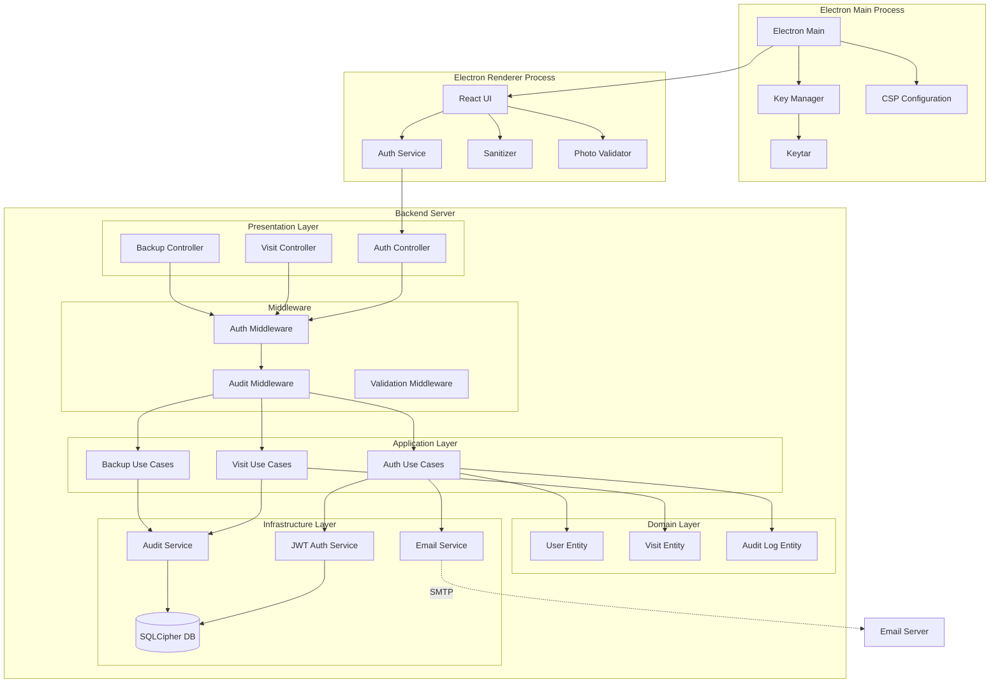
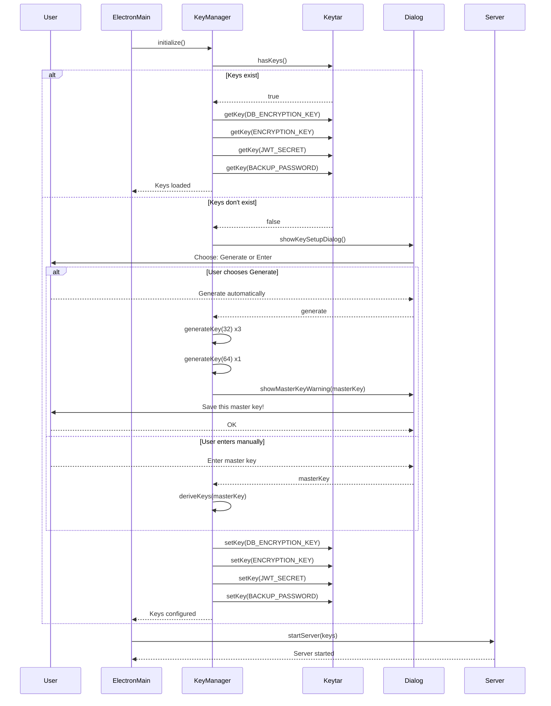
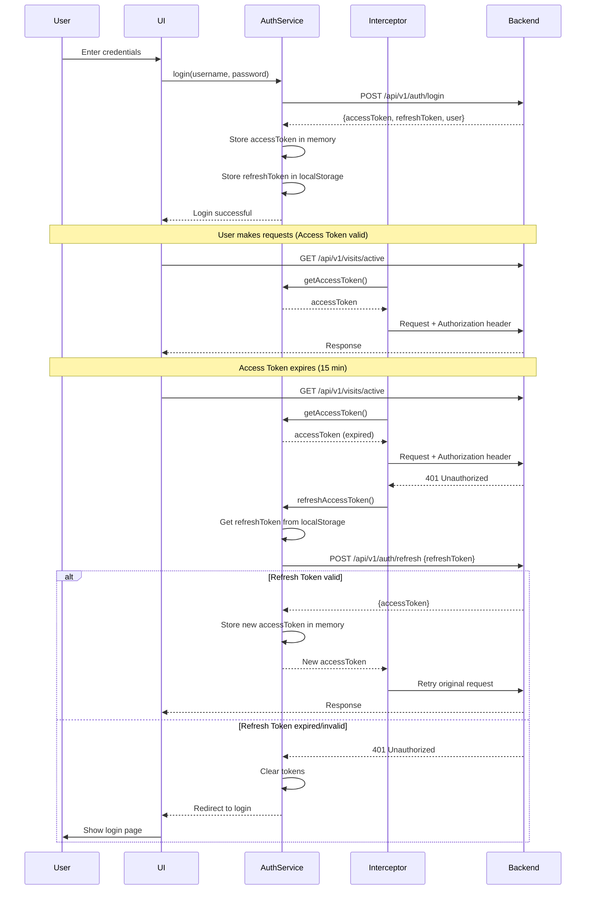
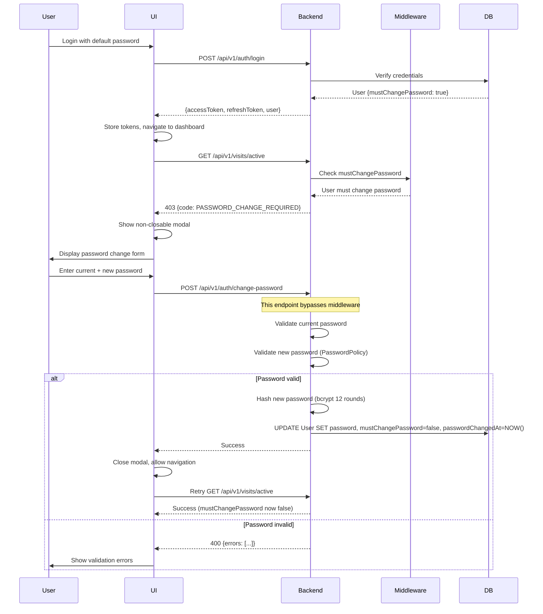
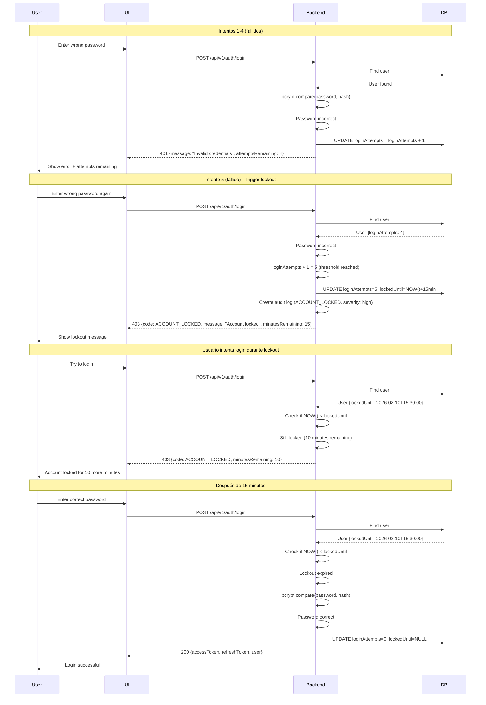
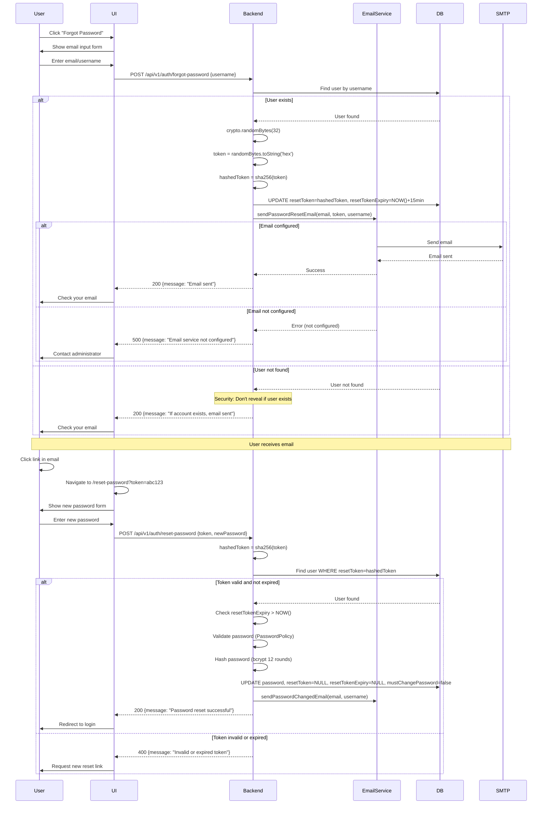

# Diseño Técnico: Mejoras de Seguridad Críticas y de Alta Prioridad

## Introducción

Este documento especifica el diseño técnico para implementar las 12 mejoras de seguridad críticas y de alta prioridad identificadas en el informe de auditoría del AF Visitor System. El diseño sigue los principios de Clean Architecture y se integra con la arquitectura existente del sistema.

### Objetivos del Diseño

1. Eliminar todas las vulnerabilidades críticas y de alta prioridad
2. Implementar gestión segura de secretos y claves criptográficas
3. Proteger contra ataques XSS, fuerza bruta y clickjacking
4. Establecer auditoría completa de eventos de seguridad
5. Implementar políticas de contraseñas robustas y cambio obligatorio
6. Mantener compatibilidad con la arquitectura existente

### Alcance

El diseño cubre:
- Backend: Express + TypeScript + Sequelize + SQLCipher
- Frontend: React + TypeScript + Vite + Axios
- Desktop: Electron 40 con IPC y procesos main/renderer separados
- Integración con Clean Architecture (Domain, Application, Infrastructure, Presentation)

## Overview

### Arquitectura de Alto Nivel

El sistema implementará mejoras de seguridad en tres capas principales:

1. **Capa de Aplicación Electron**: Gestión segura de claves usando keytar y CSP
2. **Capa Backend**: Autenticación robusta, auditoría, validación y servicios de email
3. **Capa Frontend**: Almacenamiento seguro de tokens, sanitización XSS y validación de uploads


### Diagrama de Arquitectura General



### Principios de Diseño

1. **Seguridad por Capas**: Implementar controles de seguridad en múltiples capas
2. **Principio de Menor Privilegio**: Cada componente tiene acceso solo a lo necesario
3. **Defensa en Profundidad**: Múltiples mecanismos de protección para cada amenaza
4. **Separación de Responsabilidades**: Cada capa tiene responsabilidades claras
5. **Fail Secure**: En caso de error, el sistema debe fallar de forma segura
6. **Auditoría Completa**: Todos los eventos de seguridad deben ser registrados

## Architecture

### Gestión de Claves y Secretos (Req 1 y 2)

#### Componente: KeyManager (Electron Main Process)

**Responsabilidades**:
- Inicializar y gestionar claves criptográficas
- Interactuar con el keychain del sistema operativo vía keytar
- Proporcionar claves al servidor backend de forma segura
- Manejar rotación de claves

**Ubicación**: `electron/services/KeyManager.ts`

**Dependencias**:
- `keytar`: Para acceso al keychain del sistema
- `crypto`: Para generación de claves criptográficas

**Interfaz**:
```typescript
interface IKeyManager {
  initialize(): Promise<boolean>;
  getKey(keyName: string): Promise<string | null>;
  setKey(keyName: string, value: string): Promise<void>;
  generateKey(length: number): string;
  rotateKeys(): Promise<void>;
  hasKeys(): Promise<boolean>;
}
```

**Claves Gestionadas**:
- `DB_ENCRYPTION_KEY`: 32 bytes (256 bits) para SQLCipher
- `ENCRYPTION_KEY`: 32 bytes (256 bits) para encriptación de datos
- `JWT_SECRET`: 64 bytes (512 bits) para firma de JWT
- `BACKUP_PASSWORD`: 32 bytes (256 bits) para encriptación de backups


#### Flujo de Inicialización de Claves




#### Decisiones Técnicas: Gestión de Claves

**¿Por qué keytar?**
- Integración nativa con keychains del sistema operativo (Keychain en macOS, Credential Vault en Windows, Secret Service API en Linux)
- Almacenamiento seguro con encriptación a nivel de SO
- API simple y consistente entre plataformas
- Ampliamente usado y mantenido por la comunidad de Electron

**¿Por qué crypto.randomBytes?**
- Generador criptográficamente seguro (CSPRNG)
- Parte de Node.js core, no requiere dependencias externas
- Cumple con estándares de seguridad para generación de claves

**Longitudes de Claves**:
- 32 bytes (256 bits): Estándar para AES-256 y SQLCipher
- 64 bytes (512 bits): Recomendado para HMAC-SHA256 en JWT

**Patrón Singleton**:
- KeyManager será un singleton para garantizar una única instancia
- Evita múltiples accesos concurrentes al keychain
- Centraliza la gestión de claves en un solo punto

### Autenticación con Refresh Tokens (Req 3)

#### Componente: AuthService (Frontend)

**Responsabilidades**:
- Gestionar Access Token en memoria
- Gestionar Refresh Token en localStorage
- Renovar Access Token automáticamente
- Interceptar requests HTTP y agregar token
- Manejar expiración y logout

**Ubicación**: `client/src/services/AuthService.ts`

**Interfaz**:
```typescript
interface IAuthService {
  login(username: string, password: string): Promise<LoginResponse>;
  logout(): void;
  getAccessToken(): string | null;
  refreshAccessToken(): Promise<string>;
  isAuthenticated(): boolean;
}

interface LoginResponse {
  accessToken: string;
  refreshToken: string;
  user: UserInfo;
}
```


**Almacenamiento de Tokens**:
- Access Token: Variable privada en clase (memoria volátil)
- Refresh Token: localStorage (menos crítico, alcance limitado)

**Duración de Tokens**:
- Access Token: 15 minutos
- Refresh Token: 7 días

#### Flujo de Autenticación con Refresh Token




#### Componente: JWT Auth Service (Backend)

**Responsabilidades**:
- Generar Access Token y Refresh Token
- Validar tokens
- Renovar Access Token usando Refresh Token
- Invalidar tokens en logout

**Ubicación**: `server/src/infrastructure/services/JwtAuthService.ts`

**Interfaz**:
```typescript
interface IJwtAuthService {
  generateAccessToken(payload: TokenPayload): string;
  generateRefreshToken(payload: TokenPayload): string;
  verifyAccessToken(token: string): TokenPayload | null;
  verifyRefreshToken(token: string): TokenPayload | null;
  refreshAccessToken(refreshToken: string): string | null;
}

interface TokenPayload {
  userId: number;
  username: string;
  role: string;
}
```

**Endpoints Nuevos**:
- `POST /api/v1/auth/refresh`: Renovar Access Token
- `POST /api/v1/auth/logout`: Invalidar Refresh Token (opcional, para blacklist)

#### Decisiones Técnicas: Tokens

**¿Por qué Access Token en memoria?**
- Protección contra XSS: JavaScript malicioso no puede acceder a variables privadas de clase
- Limita ventana de exposición a 15 minutos
- Se pierde al cerrar la aplicación (comportamiento deseado)

**¿Por qué Refresh Token en localStorage?**
- Permite renovación automática sin re-login constante
- Alcance limitado: solo puede obtener nuevo Access Token
- No puede realizar operaciones directamente
- Balance entre seguridad y UX

**¿Por qué no httpOnly cookies?**
- Electron no es un navegador tradicional
- Complejidad adicional con CORS y SameSite
- localStorage es suficiente para aplicación desktop


### Política de Contraseñas y Cambio Obligatorio (Req 4 y 5)

#### Componente: PasswordPolicy (Backend)

**Responsabilidades**:
- Validar contraseñas contra política robusta
- Verificar contra lista de contraseñas comunes
- Proporcionar mensajes de error específicos

**Ubicación**: `server/src/domain/services/PasswordPolicy.ts`

**Interfaz**:
```typescript
interface IPasswordPolicy {
  validate(password: string): ValidationResult;
  isCommonPassword(password: string): boolean;
}

interface ValidationResult {
  isValid: boolean;
  errors: string[];
}
```

**Reglas de Validación**:
1. Mínimo 12 caracteres
2. Máximo 128 caracteres
3. Al menos una minúscula
4. Al menos una MAYÚSCULA
5. Al menos un número
6. Al menos un símbolo especial
7. No estar en lista de top 1000 contraseñas comunes

**Lista de Contraseñas Comunes**:
- Archivo: `server/src/domain/services/common-passwords.ts`
- Fuente: SecLists (top 1000 most common passwords)
- Implementación: Set para búsqueda O(1)

#### Modelo de Usuario Extendido

**Nuevos Campos en User Model**:
```typescript
class User extends Model {
  // Campos existentes
  declare id: number;
  declare username: string;
  declare password: string;
  declare role: 'admin' | 'guard' | 'auditor';
  declare resetToken: string | null;
  declare resetTokenExpiry: Date | null;
  
  // Nuevos campos para Req 5
  declare mustChangePassword: boolean;  // default: true
  declare passwordChangedAt: Date | null;
  
  // Nuevos campos para Req 9
  declare loginAttempts: number;  // default: 0
  declare lockedUntil: Date | null;
}
```


#### Middleware: MustChangePasswordMiddleware

**Responsabilidades**:
- Interceptar requests de usuarios con `mustChangePassword=true`
- Permitir acceso solo a endpoint de cambio de contraseña
- Retornar error específico para trigger en frontend

**Ubicación**: `server/src/middleware/mustChangePassword.ts`

**Lógica**:
```typescript
if (user.mustChangePassword && req.path !== '/api/v1/auth/change-password') {
  return res.status(403).json({
    success: false,
    error: {
      code: 'PASSWORD_CHANGE_REQUIRED',
      message: 'You must change your password before continuing'
    }
  });
}
```

#### Flujo de Cambio Obligatorio de Contraseña




### Sanitización XSS y Content Security Policy (Req 6 y 7)

#### Componente: Sanitizer (Frontend)

**Responsabilidades**:
- Sanitizar inputs de usuario antes de renderizar
- Remover etiquetas HTML peligrosas
- Preservar texto plano

**Ubicación**: `client/src/utils/sanitizer.ts`

**Interfaz**:
```typescript
interface ISanitizer {
  sanitizeInput(input: string): string;
  sanitizeHTML(html: string): string;
}
```

**Funciones**:
1. `sanitizeInput()`: Remueve TODAS las etiquetas HTML
2. `sanitizeHTML()`: Permite solo etiquetas seguras (b, i, em, strong, p, br)

**Configuración DOMPurify**:
```typescript
// Para sanitizeInput (remover todo HTML)
DOMPurify.sanitize(input, { 
  ALLOWED_TAGS: [],
  KEEP_CONTENT: true 
});

// Para sanitizeHTML (permitir etiquetas seguras)
DOMPurify.sanitize(html, { 
  ALLOWED_TAGS: ['b', 'i', 'em', 'strong', 'p', 'br'],
  ALLOWED_ATTR: []
});
```

**Campos a Sanitizar**:
- Nombres de visitantes (first_name, last_name)
- Empresas (company)
- Notas (notes)
- Motivos de visita (reason, purpose)
- Persona a visitar (personToVisit)

**Componentes Afectados**:
- ActiveVisits.tsx
- VisitorList.tsx (si existe)
- VisitHistory.tsx (si existe)
- VisitForm.tsx
- WaitingVisits.tsx
- VisitDetailsModal.tsx


#### Content Security Policy (Electron)

**Responsabilidades**:
- Prevenir ejecución de scripts no autorizados
- Bloquear recursos de orígenes no confiables
- Proteger contra clickjacking

**Ubicación**: `electron/main.ts`

**Configuración CSP**:
```typescript
const CSP_POLICY = [
  "default-src 'self'",
  "script-src 'self'",
  "style-src 'self' 'unsafe-inline'",  // Tailwind CSS requiere inline
  "img-src 'self' data: blob:",  // Imágenes base64 y blob
  "connect-src 'self' http://localhost:3000",  // Backend API
  "object-src 'none'",
  "base-uri 'self'",
  "form-action 'self'",
  "frame-ancestors 'none'"
].join('; ');

mainWindow.webContents.session.webRequest.onHeadersReceived((details, callback) => {
  callback({
    responseHeaders: {
      ...details.responseHeaders,
      'Content-Security-Policy': [CSP_POLICY]
    }
  });
});
```

**Configuración de Sandbox**:
```typescript
const mainWindow = new BrowserWindow({
  webPreferences: {
    preload: path.join(__dirname, 'preload.js'),
    contextIsolation: true,
    nodeIntegration: false,
    sandbox: true  // Habilitar sandbox
  }
});
```

#### Decisiones Técnicas: XSS y CSP

**¿Por qué DOMPurify?**
- Biblioteca estándar de la industria para sanitización
- Mantenida activamente por Cure53
- Protección contra bypass conocidos
- Configuración flexible

**¿Por qué 'unsafe-inline' para styles?**
- Tailwind CSS genera estilos inline
- Alternativa sería usar nonce, pero agrega complejidad
- Riesgo mitigado: no permitimos inline scripts

**¿Por qué data: y blob: para imágenes?**
- Sistema usa base64 para fotos de visitantes
- Webcam genera blob URLs
- Sin esto, las fotos no se mostrarían


### Bcrypt y Bloqueo de Cuenta (Req 8 y 9)

#### Configuración de Bcrypt

**Ubicación**: `server/src/config/AppConfig.ts`

**Nueva Configuración**:
```typescript
class Config {
  // ... campos existentes
  
  bcryptRounds = parseInt(process.env.BCRYPT_ROUNDS || '12', 10);
}
```

**Uso en Hashing**:
```typescript
import bcrypt from 'bcrypt';
import config from '../config/AppConfig';

const hashedPassword = await bcrypt.hash(password, config.bcryptRounds);
```

**Migración Automática**:
Cuando un usuario con contraseña antigua (8 rounds) hace login exitoso:
```typescript
// En login use case
const isValid = await bcrypt.compare(password, user.password);
if (isValid) {
  // Verificar si la contraseña usa rounds antiguos
  const currentRounds = bcrypt.getRounds(user.password);
  if (currentRounds < config.bcryptRounds) {
    // Re-hashear con nuevos rounds
    const newHash = await bcrypt.hash(password, config.bcryptRounds);
    await user.update({ password: newHash });
  }
  // ... continuar con login
}
```

#### Componente: AccountLockout (Backend)

**Responsabilidades**:
- Rastrear intentos fallidos de login
- Bloquear cuenta tras 5 intentos
- Desbloquear automáticamente tras 15 minutos
- Resetear contador en login exitoso

**Ubicación**: Integrado en `server/src/application/usecases/auth/Login.usecase.ts`


#### Flujo de Bloqueo de Cuenta




#### Decisiones Técnicas: Bcrypt y Lockout

**¿Por qué 12 rounds?**
- Balance entre seguridad y performance
- OWASP recomienda mínimo 10 rounds
- 12 rounds = ~250ms de hashing (aceptable para UX)
- Protección contra ataques de fuerza bruta con hardware moderno

**¿Por qué 5 intentos?**
- Balance entre seguridad y usabilidad
- Suficiente para errores legítimos de tipeo
- Insuficiente para ataques de fuerza bruta efectivos

**¿Por qué 15 minutos de lockout?**
- Suficiente para frustrar ataques automatizados
- No tan largo como para causar frustración excesiva
- Permite desbloqueo automático sin intervención de admin

**Notificación de Intentos Restantes**:
- Después del intento 3, notificar intentos restantes
- Ayuda a usuarios legítimos a ser más cuidadosos
- No ayuda significativamente a atacantes (ya saben el límite)

### Auditoría de Eventos de Seguridad (Req 10)

#### Modelo: AuditLog

**Ubicación**: `server/src/models/AuditLog.ts` (ya existe como ActivityLog)

**Campos Extendidos**:
```typescript
class AuditLog extends Model {
  declare id: number;
  declare timestamp: Date;
  declare userId: number | null;
  declare username: string | null;
  declare role: string | null;
  declare action: string;  // LOGIN_SUCCESS, LOGIN_FAILED, ACCOUNT_LOCKED, etc.
  declare resource: string | null;  // visits, visitors, users, backups
  declare resourceId: number | null;
  declare ipAddress: string | null;
  declare userAgent: string | null;
  declare method: string | null;  // GET, POST, PUT, DELETE
  declare path: string | null;  // /api/v1/visits/123
  declare status: string;  // success, failure
  declare statusCode: number | null;  // 200, 401, 403, 500
  declare duration: number | null;  // ms
  declare details: string | null;  // JSON string con detalles adicionales
  declare severity: 'low' | 'medium' | 'high' | 'critical';
}
```


#### Middleware: AuditMiddleware

**Responsabilidades**:
- Capturar información de request y response
- Determinar severidad automáticamente
- Crear audit log de forma asíncrona
- No bloquear la respuesta HTTP

**Ubicación**: `server/src/middleware/auditor.ts` (ya existe, extender)

**Lógica de Severidad**:
```typescript
function determineSeverity(statusCode: number, method: string, action: string): Severity {
  // Critical: Errores de servidor
  if (statusCode >= 500) return 'critical';
  
  // High: Fallos de autenticación/autorización, deletes, backups, account locks
  if (statusCode === 401 || statusCode === 403) return 'high';
  if (method === 'DELETE') return 'high';
  if (action.includes('BACKUP') || action.includes('LOCKED')) return 'high';
  
  // Medium: Fallos de validación, operaciones fallidas
  if (statusCode >= 400) return 'medium';
  if (action.includes('FAILED')) return 'medium';
  
  // Low: Operaciones exitosas
  return 'low';
}
```

**Eventos a Auditar**:

1. **Autenticación**:
   - LOGIN_SUCCESS
   - LOGIN_FAILED
   - LOGOUT
   - PASSWORD_CHANGED
   - PASSWORD_RESET_REQUESTED
   - PASSWORD_RESET_COMPLETED
   - ACCOUNT_LOCKED
   - ACCOUNT_UNLOCKED

2. **Autorización**:
   - ACCESS_DENIED (403)
   - UNAUTHORIZED_ACCESS (401)

3. **Datos**:
   - VISITOR_CREATED
   - VISITOR_UPDATED
   - VISITOR_DELETED
   - VISIT_CHECKIN
   - VISIT_CHECKOUT
   - VISIT_ADMITTED

4. **Administrativos**:
   - BACKUP_CREATED
   - BACKUP_RESTORED
   - DATA_EXPORTED
   - USER_CREATED
   - USER_UPDATED
   - USER_DELETED


#### Implementación Asíncrona

**Patrón Fire-and-Forget**:
```typescript
// En middleware
res.on('finish', () => {
  // No await - fire and forget
  createAuditLog({
    userId: req.user?.id,
    action: determineAction(req),
    // ... otros campos
  }).catch(err => {
    console.error('Failed to create audit log:', err);
    // No fallar la operación principal
  });
});
```

**Beneficios**:
- No agrega latencia a las respuestas HTTP
- Fallos en auditoría no afectan operaciones principales
- Logs se crean en background

### Email Service (Req 11)

#### Componente: EmailService

**Responsabilidades**:
- Enviar emails de recuperación de contraseña
- Enviar emails de confirmación
- Manejar errores de SMTP gracefully

**Ubicación**: `server/src/infrastructure/services/EmailService.ts`

**Interfaz**:
```typescript
interface IEmailService {
  sendPasswordResetEmail(to: string, token: string, username: string): Promise<void>;
  sendPasswordChangedEmail(to: string, username: string): Promise<void>;
  isConfigured(): boolean;
}
```

**Configuración**:
```typescript
class EmailService implements IEmailService {
  private transporter: nodemailer.Transporter | null = null;
  
  constructor() {
    if (this.isConfigured()) {
      this.transporter = nodemailer.createTransport({
        host: process.env.SMTP_HOST,
        port: parseInt(process.env.SMTP_PORT || '587'),
        secure: process.env.SMTP_SECURE === 'true',
        auth: {
          user: process.env.SMTP_USER,
          pass: process.env.SMTP_PASSWORD
        }
      });
    }
  }
  
  isConfigured(): boolean {
    return !!(
      process.env.SMTP_HOST &&
      process.env.SMTP_USER &&
      process.env.SMTP_PASSWORD
    );
  }
}
```


#### Flujo de Recuperación de Contraseña




#### Templates de Email

**Password Reset Email**:
```html
Subject: Password Reset Request - AF Visitor System

Hello {{username}},

You have requested to reset your password for the AF Visitor System.

Click the link below to reset your password:
{{resetLink}}

This link will expire in 15 minutes.

If you did not request this password reset, please ignore this email and your password will remain unchanged.

For security reasons, we recommend:
- Using a strong, unique password
- Not sharing your password with anyone
- Changing your password regularly

Best regards,
AF Visitor System Team
```

**Password Changed Confirmation**:
```html
Subject: Password Changed Successfully - AF Visitor System

Hello {{username}},

Your password has been changed successfully.

If you did not make this change, please contact your system administrator immediately.

Best regards,
AF Visitor System Team
```

#### Decisiones Técnicas: Email

**¿Por qué nodemailer?**
- Biblioteca estándar para Node.js
- Soporte para múltiples transportes (SMTP, SendGrid, etc.)
- Bien documentada y mantenida

**¿Por qué SHA-256 para token?**
- Si la DB es comprometida, tokens hasheados no son útiles
- SHA-256 es suficiente para este propósito (no necesita bcrypt)
- Rápido de computar

**¿Por qué 15 minutos de expiración?**
- Balance entre seguridad y usabilidad
- Suficiente tiempo para que usuario revise email
- Ventana corta para limitar exposición

**Manejo de Errores**:
- No revelar si usuario existe (prevenir enumeración)
- Registrar errores de SMTP pero no exponer detalles
- Permitir que sistema funcione sin email (degradación graceful)


### Validación de Fotos (Req 12)

#### Componente: PhotoValidator (Frontend)

**Responsabilidades**:
- Validar tipo de archivo (JPEG/PNG)
- Validar tamaño de archivo (máx 5MB)
- Proporcionar feedback inmediato al usuario

**Ubicación**: `client/src/utils/photoValidator.ts`

**Interfaz**:
```typescript
interface IPhotoValidator {
  validateImage(base64String: string): ValidationResult;
  getImageSize(base64String: string): number;
  getImageType(base64String: string): string | null;
}

interface ValidationResult {
  isValid: boolean;
  error?: string;
  size?: number;
  type?: string;
}
```

**Implementación**:
```typescript
const ALLOWED_TYPES = [
  'data:image/jpeg;base64,',
  'data:image/jpg;base64,',
  'data:image/png;base64,'
];

const MAX_SIZE_BYTES = 5 * 1024 * 1024; // 5MB

function validateImage(base64String: string): ValidationResult {
  // Validar tipo
  const type = getImageType(base64String);
  if (!type) {
    return {
      isValid: false,
      error: 'Invalid image type. Only JPEG and PNG are allowed.'
    };
  }
  
  // Validar tamaño
  const size = getImageSize(base64String);
  if (size > MAX_SIZE_BYTES) {
    const sizeMB = (size / (1024 * 1024)).toFixed(2);
    return {
      isValid: false,
      error: `Image size (${sizeMB}MB) exceeds maximum allowed size of 5MB.`
    };
  }
  
  return {
    isValid: true,
    size,
    type
  };
}

function getImageType(base64String: string): string | null {
  for (const type of ALLOWED_TYPES) {
    if (base64String.startsWith(type)) {
      return type;
    }
  }
  return null;
}

function getImageSize(base64String: string): number {
  // Remover prefijo data:image/...;base64,
  const base64Data = base64String.split(',')[1] || base64String;
  
  // Calcular tamaño: (length * 3/4) - padding
  const padding = (base64Data.match(/=/g) || []).length;
  return (base64Data.length * 3 / 4) - padding;
}
```


#### Integración en PhotoCapture

**Ubicación**: `client/src/components/PhotoCapture.tsx`

**Puntos de Validación**:
1. Después de capturar desde webcam
2. Antes de enviar al servidor

```typescript
// En PhotoCapture component
const handleCapture = () => {
  const imageSrc = webcamRef.current?.getScreenshot();
  if (!imageSrc) return;
  
  // Validar imagen
  const validation = validateImage(imageSrc);
  if (!validation.isValid) {
    toast.error(validation.error);
    return;
  }
  
  // Imagen válida, continuar
  onPhotoCapture(imageSrc);
};

const handleUpload = (event: React.ChangeEvent<HTMLInputElement>) => {
  const file = event.target.files?.[0];
  if (!file) return;
  
  const reader = new FileReader();
  reader.onload = (e) => {
    const base64 = e.target?.result as string;
    
    // Validar imagen
    const validation = validateImage(base64);
    if (!validation.isValid) {
      toast.error(validation.error);
      return;
    }
    
    // Imagen válida, continuar
    onPhotoCapture(base64);
  };
  reader.readAsDataURL(file);
};
```

#### Validación Backend (Defensa en Profundidad)

**Ubicación**: `server/src/utils/PhotoStorage.ts`

**Validación Adicional**:
```typescript
function validatePhotoUpload(base64String: string): void {
  // Validar tipo
  const validPrefixes = [
    'data:image/jpeg;base64,',
    'data:image/jpg;base64,',
    'data:image/png;base64,'
  ];
  
  const hasValidPrefix = validPrefixes.some(prefix => 
    base64String.startsWith(prefix)
  );
  
  if (!hasValidPrefix) {
    throw new Error('Invalid image type');
  }
  
  // Validar tamaño
  const base64Data = base64String.split(',')[1];
  const sizeBytes = (base64Data.length * 3 / 4) - 
    (base64Data.match(/=/g) || []).length;
  
  if (sizeBytes > 5 * 1024 * 1024) {
    throw new Error('Image size exceeds 5MB limit');
  }
}
```


## Components and Interfaces

### Nuevos Componentes

#### 1. KeyManager (Electron)
```typescript
// electron/services/KeyManager.ts
export class KeyManager {
  private static instance: KeyManager;
  private keys: Map<string, string> = new Map();
  
  private constructor() {}
  
  static getInstance(): KeyManager {
    if (!KeyManager.instance) {
      KeyManager.instance = new KeyManager();
    }
    return KeyManager.instance;
  }
  
  async initialize(): Promise<boolean>;
  async getKey(keyName: string): Promise<string | null>;
  async setKey(keyName: string, value: string): Promise<void>;
  generateKey(length: number): string;
  async rotateKeys(): Promise<void>;
  async hasKeys(): Promise<boolean>;
}
```

#### 2. AuthService (Frontend)
```typescript
// client/src/services/AuthService.ts
export class AuthService {
  private static instance: AuthService;
  private accessToken: string | null = null;
  
  private constructor() {}
  
  static getInstance(): AuthService {
    if (!AuthService.instance) {
      AuthService.instance = new AuthService();
    }
    return AuthService.instance;
  }
  
  async login(username: string, password: string): Promise<LoginResponse>;
  logout(): void;
  getAccessToken(): string | null;
  async refreshAccessToken(): Promise<string>;
  isAuthenticated(): boolean;
}
```

#### 3. PasswordPolicy (Backend)
```typescript
// server/src/domain/services/PasswordPolicy.ts
export class PasswordPolicy {
  validate(password: string): ValidationResult;
  isCommonPassword(password: string): boolean;
  private checkLength(password: string): boolean;
  private checkComplexity(password: string): boolean;
}
```

#### 4. Sanitizer (Frontend)
```typescript
// client/src/utils/sanitizer.ts
export const sanitizer = {
  sanitizeInput(input: string): string;
  sanitizeHTML(html: string): string;
};
```

#### 5. EmailService (Backend)
```typescript
// server/src/infrastructure/services/EmailService.ts
export class EmailService implements IEmailService {
  private transporter: nodemailer.Transporter | null;
  
  constructor();
  async sendPasswordResetEmail(to: string, token: string, username: string): Promise<void>;
  async sendPasswordChangedEmail(to: string, username: string): Promise<void>;
  isConfigured(): boolean;
}
```

#### 6. PhotoValidator (Frontend)
```typescript
// client/src/utils/photoValidator.ts
export const photoValidator = {
  validateImage(base64String: string): ValidationResult;
  getImageSize(base64String: string): number;
  getImageType(base64String: string): string | null;
};
```


### Componentes Modificados

#### 1. User Model (Backend)
```typescript
// server/src/models/User.ts
class User extends Model {
  // Campos existentes
  declare id: number;
  declare username: string;
  declare password: string;
  declare role: 'admin' | 'guard' | 'auditor';
  declare resetToken: string | null;
  declare resetTokenExpiry: Date | null;
  
  // Nuevos campos
  declare mustChangePassword: boolean;
  declare passwordChangedAt: Date | null;
  declare loginAttempts: number;
  declare lockedUntil: Date | null;
}
```

#### 2. Auth Middleware (Backend)
```typescript
// server/src/middleware/auth.ts
export const verifyToken = (req, res, next) => {
  // Verificar Access Token
  // Verificar mustChangePassword
  // Verificar account lockout
};

export const mustChangePassword = (req, res, next) => {
  if (req.user.mustChangePassword && req.path !== '/api/v1/auth/change-password') {
    return res.status(403).json({
      success: false,
      error: {
        code: 'PASSWORD_CHANGE_REQUIRED',
        message: 'You must change your password'
      }
    });
  }
  next();
};
```

#### 3. API Service (Frontend)
```typescript
// client/src/services/api.v1.ts
const api = axios.create({
  baseURL: API_URL,
  headers: { 'Content-Type': 'application/json' }
});

// Interceptor de request
api.interceptors.request.use((config) => {
  const token = AuthService.getInstance().getAccessToken();
  if (token) {
    config.headers.Authorization = `Bearer ${token}`;
  }
  return config;
});

// Interceptor de response
api.interceptors.response.use(
  (response) => response,
  async (error) => {
    const originalRequest = error.config;
    
    // Si es 401 y no es retry, intentar refresh
    if (error.response?.status === 401 && !originalRequest._retry) {
      originalRequest._retry = true;
      
      try {
        const newToken = await AuthService.getInstance().refreshAccessToken();
        originalRequest.headers.Authorization = `Bearer ${newToken}`;
        return api(originalRequest);
      } catch (refreshError) {
        // Refresh falló, redirigir a login
        AuthService.getInstance().logout();
        window.location.href = '/login';
        return Promise.reject(refreshError);
      }
    }
    
    // Si es PASSWORD_CHANGE_REQUIRED, mostrar modal
    if (error.response?.data?.error?.code === 'PASSWORD_CHANGE_REQUIRED') {
      // Trigger modal de cambio de contraseña
      window.dispatchEvent(new CustomEvent('password-change-required'));
    }
    
    return Promise.reject(error);
  }
);
```


### Interfaces de Dominio

#### IKeyManager
```typescript
interface IKeyManager {
  initialize(): Promise<boolean>;
  getKey(keyName: string): Promise<string | null>;
  setKey(keyName: string, value: string): Promise<void>;
  generateKey(length: number): string;
  rotateKeys(): Promise<void>;
  hasKeys(): Promise<boolean>;
}
```

#### IAuthService
```typescript
interface IAuthService {
  login(username: string, password: string): Promise<LoginResponse>;
  logout(): void;
  getAccessToken(): string | null;
  refreshAccessToken(): Promise<string>;
  isAuthenticated(): boolean;
}
```

#### IPasswordPolicy
```typescript
interface IPasswordPolicy {
  validate(password: string): ValidationResult;
  isCommonPassword(password: string): boolean;
}

interface ValidationResult {
  isValid: boolean;
  errors: string[];
}
```

#### IEmailService
```typescript
interface IEmailService {
  sendPasswordResetEmail(to: string, token: string, username: string): Promise<void>;
  sendPasswordChangedEmail(to: string, username: string): Promise<void>;
  isConfigured(): boolean;
}
```

#### ISanitizer
```typescript
interface ISanitizer {
  sanitizeInput(input: string): string;
  sanitizeHTML(html: string): string;
}
```

#### IPhotoValidator
```typescript
interface IPhotoValidator {
  validateImage(base64String: string): ValidationResult;
  getImageSize(base64String: string): number;
  getImageType(base64String: string): string | null;
}
```


## Data Models

### User Model (Extendido)

```typescript
{
  id: number;                          // PK, auto-increment
  username: string;                    // Unique, not null
  password: string;                    // Bcrypt hash, not null
  role: 'admin' | 'guard' | 'auditor'; // Default: 'guard'
  
  // Password reset
  resetToken: string | null;           // SHA-256 hash
  resetTokenExpiry: Date | null;       // Timestamp
  
  // Password policy (NEW)
  mustChangePassword: boolean;         // Default: true
  passwordChangedAt: Date | null;      // Timestamp
  
  // Account lockout (NEW)
  loginAttempts: number;               // Default: 0
  lockedUntil: Date | null;            // Timestamp
  
  // Timestamps
  createdAt: Date;
  updatedAt: Date;
}
```

### AuditLog Model (Extendido)

```typescript
{
  id: number;                          // PK, auto-increment
  timestamp: Date;                     // Not null, default: NOW()
  
  // User context
  userId: number | null;               // FK to User
  username: string | null;
  role: string | null;
  
  // Action
  action: string;                      // LOGIN_SUCCESS, VISITOR_CREATED, etc.
  resource: string | null;             // visits, visitors, users, backups
  resourceId: number | null;           // ID del recurso afectado
  
  // Request context (NEW)
  ipAddress: string | null;
  userAgent: string | null;
  method: string | null;               // GET, POST, PUT, DELETE
  path: string | null;                 // /api/v1/visits/123
  
  // Response context (NEW)
  status: string;                      // success, failure
  statusCode: number | null;           // 200, 401, 403, 500
  duration: number | null;             // Milliseconds
  
  // Additional info
  details: string | null;              // JSON string
  severity: 'low' | 'medium' | 'high' | 'critical'; // NEW
  
  // Timestamps
  createdAt: Date;
}
```

### Migration Scripts

#### 1. Add Password Policy Fields
```sql
-- Migration: add-password-policy-fields.sql
ALTER TABLE Users ADD COLUMN mustChangePassword BOOLEAN DEFAULT 1;
ALTER TABLE Users ADD COLUMN passwordChangedAt DATETIME NULL;
```

#### 2. Add Account Lockout Fields
```sql
-- Migration: add-account-lockout-fields.sql
ALTER TABLE Users ADD COLUMN loginAttempts INTEGER DEFAULT 0;
ALTER TABLE Users ADD COLUMN lockedUntil DATETIME NULL;
```

#### 3. Extend AuditLog Fields
```sql
-- Migration: extend-audit-log-fields.sql
ALTER TABLE ActivityLogs ADD COLUMN ipAddress VARCHAR(45) NULL;
ALTER TABLE ActivityLogs ADD COLUMN userAgent TEXT NULL;
ALTER TABLE ActivityLogs ADD COLUMN method VARCHAR(10) NULL;
ALTER TABLE ActivityLogs ADD COLUMN path VARCHAR(255) NULL;
ALTER TABLE ActivityLogs ADD COLUMN statusCode INTEGER NULL;
ALTER TABLE ActivityLogs ADD COLUMN duration INTEGER NULL;
ALTER TABLE ActivityLogs ADD COLUMN severity VARCHAR(20) DEFAULT 'low';
```


### Configuración de Variables de Entorno

#### .env.example (Actualizado)

```bash
# Server
PORT=3000
NODE_ENV=development

# Database (REMOVED - now managed by KeyManager)
# DB_ENCRYPTION_KEY=
# ENCRYPTION_KEY=

# JWT (REMOVED - now managed by KeyManager)
# JWT_SECRET=

# Backup (REMOVED - now managed by KeyManager)
# BACKUP_PASSWORD=

# Security
BCRYPT_ROUNDS=12
MAX_LOGIN_ATTEMPTS=5
LOCKOUT_DURATION_MINUTES=15

# Email Configuration
SMTP_HOST=smtp.gmail.com
SMTP_PORT=587
SMTP_SECURE=false
SMTP_USER=your-email@gmail.com
SMTP_PASSWORD=your-app-password
EMAIL_FROM=noreply@afvisitorsystem.com
APP_URL=http://localhost:5173

# GDPR
DATA_RETENTION_DAYS=60

# Rate Limiting
RATE_LIMIT_WINDOW_MS=60000
RATE_LIMIT_MAX_REQUESTS=100
```

## Error Handling

### Categorías de Errores

#### 1. Errores de Autenticación
```typescript
{
  code: 'INVALID_CREDENTIALS',
  message: 'Invalid username or password',
  statusCode: 401
}

{
  code: 'ACCOUNT_LOCKED',
  message: 'Account locked due to multiple failed login attempts',
  statusCode: 403,
  data: {
    minutesRemaining: 10,
    lockedUntil: '2026-02-10T15:30:00Z'
  }
}

{
  code: 'PASSWORD_CHANGE_REQUIRED',
  message: 'You must change your password before continuing',
  statusCode: 403
}

{
  code: 'TOKEN_EXPIRED',
  message: 'Access token has expired',
  statusCode: 401
}

{
  code: 'REFRESH_TOKEN_INVALID',
  message: 'Refresh token is invalid or expired',
  statusCode: 401
}
```


#### 2. Errores de Validación
```typescript
{
  code: 'VALIDATION_ERROR',
  message: 'Password does not meet security requirements',
  statusCode: 400,
  data: {
    errors: [
      'Password must be at least 12 characters',
      'Password must contain at least one uppercase letter',
      'Password must contain at least one special character'
    ]
  }
}

{
  code: 'COMMON_PASSWORD',
  message: 'Password is too common and easily guessable',
  statusCode: 400
}

{
  code: 'INVALID_IMAGE_TYPE',
  message: 'Invalid image type. Only JPEG and PNG are allowed',
  statusCode: 400
}

{
  code: 'IMAGE_TOO_LARGE',
  message: 'Image size exceeds maximum allowed size of 5MB',
  statusCode: 400,
  data: {
    size: 6291456,
    maxSize: 5242880
  }
}
```

#### 3. Errores de Configuración
```typescript
{
  code: 'EMAIL_NOT_CONFIGURED',
  message: 'Email service is not configured',
  statusCode: 500
}

{
  code: 'KEYS_NOT_CONFIGURED',
  message: 'Encryption keys are not configured',
  statusCode: 500
}
```

#### 4. Errores de Sistema
```typescript
{
  code: 'AUDIT_LOG_FAILED',
  message: 'Failed to create audit log',
  statusCode: 500,
  // No detener operación principal
}

{
  code: 'EMAIL_SEND_FAILED',
  message: 'Failed to send email',
  statusCode: 500,
  // Registrar pero no exponer detalles
}
```

### Estrategia de Manejo de Errores

#### Principios
1. **Fail Secure**: En caso de error, fallar de forma segura
2. **No Exponer Detalles**: No revelar información sensible en mensajes de error
3. **Logging Completo**: Registrar todos los errores con contexto completo
4. **Degradación Graceful**: Sistema debe funcionar con funcionalidad reducida si es posible

#### Implementación

**Backend Error Handler**:
```typescript
// server/src/middleware/error.ts
export const errorHandler = (err: Error, req: Request, res: Response, next: NextFunction) => {
  // Log completo del error (interno)
  console.error('Error:', {
    message: err.message,
    stack: err.stack,
    path: req.path,
    method: req.method,
    user: req.user?.username
  });
  
  // Respuesta al cliente (sin detalles sensibles)
  if (err instanceof ValidationError) {
    return res.status(400).json({
      success: false,
      error: {
        code: 'VALIDATION_ERROR',
        message: err.message,
        data: err.errors
      }
    });
  }
  
  // Error genérico para errores no manejados
  res.status(500).json({
    success: false,
    error: {
      code: 'INTERNAL_SERVER_ERROR',
      message: 'An unexpected error occurred'
    }
  });
};
```


**Frontend Error Handler**:
```typescript
// client/src/utils/errorHandler.ts
export const handleApiError = (error: any) => {
  if (error.response?.data?.error) {
    const { code, message, data } = error.response.data.error;
    
    switch (code) {
      case 'PASSWORD_CHANGE_REQUIRED':
        // Trigger modal
        window.dispatchEvent(new CustomEvent('password-change-required'));
        break;
        
      case 'ACCOUNT_LOCKED':
        toast.error(`Account locked. Try again in ${data.minutesRemaining} minutes.`);
        break;
        
      case 'VALIDATION_ERROR':
        // Mostrar errores específicos
        data.errors.forEach((err: string) => toast.error(err));
        break;
        
      default:
        toast.error(message || 'An error occurred');
    }
  } else {
    toast.error('Network error. Please try again.');
  }
};
```

### Casos Edge

#### 1. Usuario Intenta Login Durante Lockout
- Verificar `lockedUntil` antes de verificar contraseña
- No incrementar `loginAttempts` durante lockout
- Retornar tiempo restante de bloqueo

#### 2. Access Token Expira Durante Request
- Interceptor detecta 401
- Intenta refresh automáticamente
- Reintenta request original con nuevo token
- Si refresh falla, redirige a login

#### 3. Refresh Token Expira
- Usuario debe hacer login nuevamente
- Limpiar tokens de memoria y localStorage
- Redirigir a página de login
- Mostrar mensaje informativo

#### 4. Usuario Cierra Aplicación con Sesión Activa
- Access Token se pierde (memoria volátil)
- Refresh Token permanece en localStorage
- Al reabrir, debe hacer login (Access Token no existe)
- Alternativa: Intentar refresh automático al iniciar

#### 5. Email Service No Configurado
- Endpoint de forgot-password retorna error claro
- Sistema continúa funcionando sin recuperación de contraseña
- Administrador puede resetear contraseñas manualmente
- Documentar configuración en README

#### 6. Keychain No Disponible
- Mostrar error al iniciar Electron
- No permitir inicio del servidor
- Proporcionar instrucciones para configurar keychain
- Fallback: Solicitar claves manualmente cada vez (no recomendado)

#### 7. Foto Excede 5MB Después de Captura
- Validar inmediatamente después de captura
- Mostrar error antes de permitir continuar
- Sugerir reducir calidad de webcam
- Alternativa: Comprimir automáticamente (futuro)

#### 8. XSS en Datos Existentes
- Sanitizar al renderizar, no al almacenar
- Datos antiguos se sanitizan automáticamente
- No requiere migración de datos
- Protección retroactiva

#### 9. Contraseña Antigua (8 rounds) en Login
- Verificar rounds después de login exitoso
- Re-hashear automáticamente con 12 rounds
- Transparente para el usuario
- Migración progresiva

#### 10. Múltiples Sesiones del Mismo Usuario
- Cada sesión tiene su propio Access Token
- Refresh Token puede ser compartido (mismo usuario)
- Logout invalida Refresh Token (afecta todas las sesiones)
- Alternativa: Implementar blacklist de tokens (futuro)


## Performance Considerations

### Bcrypt Performance

**Impacto**:
- 8 rounds: ~50ms por hash
- 12 rounds: ~250ms por hash
- Incremento: 5x más lento

**Mitigación**:
- Solo afecta operaciones de hashing (login, cambio de contraseña, registro)
- No afecta operaciones de lectura
- 250ms es aceptable para UX de autenticación
- Beneficio de seguridad supera costo de performance

### Auditoría Asíncrona

**Estrategia**:
- Crear audit logs en background (fire-and-forget)
- No bloquear respuesta HTTP
- Usar `res.on('finish')` para capturar después de enviar respuesta

**Beneficios**:
- Cero latencia adicional para usuario
- Fallos en auditoría no afectan operación principal
- Throughput no se ve afectado

### Sanitización en Frontend

**Impacto**:
- DOMPurify es muy rápido (~1ms por string)
- Sanitizar al renderizar, no al almacenar
- Caching de resultados sanitizados (React memoization)

**Optimización**:
```typescript
// Usar useMemo para cachear sanitización
const sanitizedName = useMemo(
  () => sanitizer.sanitizeInput(visitor.name),
  [visitor.name]
);
```

### Validación de Fotos

**Impacto**:
- Cálculo de tamaño: O(1) - solo length
- Validación de tipo: O(1) - startsWith
- Negligible para UX

### Refresh Token Flow

**Impacto**:
- Request adicional cuando Access Token expira
- Ocurre cada 15 minutos
- Transparente para usuario (automático)

**Optimización**:
- Renovar proactivamente antes de expiración (ej: 1 min antes)
- Evita que usuario experimente delay

```typescript
// Renovar proactivamente
setInterval(() => {
  const token = AuthService.getInstance().getAccessToken();
  if (token) {
    const decoded = jwt_decode(token);
    const expiresIn = decoded.exp * 1000 - Date.now();
    
    // Si expira en menos de 1 minuto, renovar
    if (expiresIn < 60000) {
      AuthService.getInstance().refreshAccessToken();
    }
  }
}, 30000); // Check cada 30 segundos
```

### Keytar Performance

**Impacto**:
- Acceso a keychain: ~10-50ms
- Solo ocurre al iniciar aplicación
- Claves se cachean en memoria después

**Optimización**:
- Cargar todas las claves al inicio
- Cachear en memoria durante ejecución
- No acceder a keychain en cada request


## Correctness Properties

*A property is a characteristic or behavior that should hold true across all valid executions of a system-essentially, a formal statement about what the system should do. Properties serve as the bridge between human-readable specifications and machine-verifiable correctness guarantees.*

### Property Reflection

Después de analizar todos los criterios de aceptación, he identificado las siguientes áreas de redundancia:

**Redundancias Identificadas**:

1. **Password Policy (4.1-4.7)**: Las propiedades individuales de validación (minúsculas, mayúsculas, números, símbolos, longitud) pueden combinarse en una sola propiedad comprehensiva que valida la política completa.

2. **CSP Configuration (7.2-7.10)**: Todas las directivas CSP individuales pueden combinarse en una propiedad que verifica la configuración completa de CSP.

3. **Audit Events (10.1-10.4)**: Los eventos específicos de auditoría pueden agruparse por categoría en lugar de listar cada evento individualmente.

4. **Token Durations (3.4, 3.5)**: Pueden combinarse en una propiedad que verifica duraciones de ambos tipos de tokens.

5. **Key Lengths (2.3, 2.4)**: Pueden combinarse en una propiedad que verifica longitudes apropiadas para todos los tipos de claves.

**Propiedades Consolidadas**:
- En lugar de 7 propiedades separadas para password policy, una propiedad comprehensiva
- En lugar de 9 propiedades para CSP, una propiedad de configuración completa
- En lugar de múltiples propiedades de longitud de claves, una propiedad general
- Mantener propiedades separadas cuando representan comportamientos distintos (ej: lockout, sanitización, validación de fotos)


### Property 1: Key Storage Round Trip

*For any* encryption key (DB_ENCRYPTION_KEY, ENCRYPTION_KEY, JWT_SECRET, BACKUP_PASSWORD), storing the key in the keychain and then retrieving it should return the same value.

**Validates: Requirements 1.3, 1.4**

### Property 2: Generated Key Lengths

*For any* generated encryption key, the key length should match the specified requirements: 32 bytes for DB_ENCRYPTION_KEY and ENCRYPTION_KEY, 64 bytes for JWT_SECRET.

**Validates: Requirements 1.6, 2.2, 2.3, 2.4**

### Property 3: Access Token Memory Storage

*For any* authentication session, the Access Token should never be stored in localStorage, only in memory.

**Validates: Requirements 3.2, 3.11**

### Property 4: Token Duration Validation

*For any* generated JWT token, Access Tokens should have an expiration of 15 minutes and Refresh Tokens should have an expiration of 7 days.

**Validates: Requirements 3.4, 3.5**

### Property 5: Token Refresh on Expiration

*For any* expired Access Token with a valid Refresh Token, the system should automatically obtain a new Access Token without requiring re-authentication.

**Validates: Requirements 3.6**

### Property 6: HTTP Request Token Injection

*For any* authenticated HTTP request, the interceptor should automatically add the Access Token to the Authorization header.

**Validates: Requirements 3.8**

### Property 7: Password Policy Validation

*For any* password submission (creation, change, reset), the system should validate that it meets all requirements: minimum 12 characters, maximum 128 characters, at least one lowercase letter, one uppercase letter, one number, one special character, and not in the common passwords list.

**Validates: Requirements 4.1, 4.2, 4.3, 4.4, 4.5, 4.6, 4.7, 4.8**

### Property 8: Password Validation Error Messages

*For any* password that fails validation, the system should return specific error messages indicating which requirements are not met.

**Validates: Requirements 4.9**

### Property 9: Must Change Password Enforcement

*For any* user with mustChangePassword=true attempting to access any endpoint except /api/v1/auth/change-password, the system should return HTTP 403 with code PASSWORD_CHANGE_REQUIRED.

**Validates: Requirements 5.3**

### Property 10: Password Change State Update

*For any* successful password change, the system should set mustChangePassword=false and update passwordChangedAt to the current timestamp.

**Validates: Requirements 5.5, 5.8**

### Property 11: Password Policy Application on Change

*For any* password change attempt, the new password should be validated against the Password Policy.

**Validates: Requirements 5.10**


### Property 12: HTML Tag Removal in sanitizeInput

*For any* string containing HTML tags, sanitizeInput() should remove all HTML tags while preserving the text content.

**Validates: Requirements 6.2, 6.7, 6.8**

### Property 13: Safe HTML Tag Allowlist in sanitizeHTML

*For any* string containing HTML tags, sanitizeHTML() should allow only safe tags (b, i, em, strong, p, br) and remove all other tags.

**Validates: Requirements 6.3**

### Property 14: XSS Prevention in User Inputs

*For any* user input containing malicious scripts (script tags, event handlers, javascript: URLs), the sanitization should remove the dangerous code before rendering.

**Validates: Requirements 6.7**

### Property 15: Bcrypt Rounds for New Passwords

*For any* newly hashed password, the system should use 12 bcrypt rounds.

**Validates: Requirements 8.1**

### Property 16: Bcrypt Compatibility and Migration

*For any* user with a password hashed with 8 rounds who successfully logs in, the system should re-hash the password with 12 rounds.

**Validates: Requirements 8.7, 8.8**

### Property 17: Account Lockout Check on Login

*For any* login attempt, if the user's lockedUntil timestamp is greater than the current time, the system should reject the login and return the remaining lockout time.

**Validates: Requirements 9.3, 9.4**

### Property 18: Login Attempt Increment on Failure

*For any* failed login attempt (when account is not locked), the system should increment loginAttempts by 1.

**Validates: Requirements 9.5**

### Property 19: Account Lockout Trigger

*For any* user whose loginAttempts reaches 5, the system should set lockedUntil to 15 minutes in the future.

**Validates: Requirements 9.6**

### Property 20: Login Attempt Reset on Success

*For any* successful login, the system should reset loginAttempts to 0 and lockedUntil to null.

**Validates: Requirements 9.7**

### Property 21: Account Lockout Audit Log

*For any* account that becomes locked, the system should create an Audit Log entry with action ACCOUNT_LOCKED and severity high.

**Validates: Requirements 9.8**

### Property 22: Remaining Attempts Notification

*For any* failed login attempt where loginAttempts is 3 or more, the system should notify the user of the remaining attempts before lockout.

**Validates: Requirements 9.10**


### Property 23: Audit Log Completeness

*For any* audit log entry, it should include all required fields: timestamp, userId, username, role, action, resource, resourceId, ipAddress, userAgent, method, path, status, statusCode, duration, details, and severity.

**Validates: Requirements 10.5**

### Property 24: Audit Severity Determination

*For any* audit log entry, the severity should be automatically determined based on status code and action: critical for 5xx, high for 401/403/DELETE/backup operations, medium for 4xx failures, low for successful operations.

**Validates: Requirements 10.7**

### Property 25: Audit Log Error Resilience

*For any* error that occurs while creating an audit log, the system should log the error to console but not fail the primary operation.

**Validates: Requirements 10.9**

### Property 26: Password Reset Token Generation

*For any* password reset request, the system should generate a secure 32-byte token using crypto.randomBytes.

**Validates: Requirements 11.3**

### Property 27: Password Reset Token Hashing

*For any* password reset token, the system should hash it with SHA-256 before storing in the database.

**Validates: Requirements 11.4**

### Property 28: Password Reset Token Expiration

*For any* password reset request, the resetTokenExpiry should be set to 15 minutes in the future.

**Validates: Requirements 11.5**

### Property 29: Password Reset Email Content

*For any* password reset email, it should include: personalized greeting, explanation, reset link with unhashed token, expiration time, and warning if not requested.

**Validates: Requirements 11.6, 11.7**

### Property 30: Password Reset Token Validation

*For any* password reset attempt, the system should validate that the token has not expired before allowing the reset.

**Validates: Requirements 11.8**

### Property 31: Password Reset Token Invalidation

*For any* successful password reset, the system should immediately invalidate the token by setting resetToken and resetTokenExpiry to null.

**Validates: Requirements 11.9**

### Property 32: Password Change Confirmation Email

*For any* successful password change, the system should send a confirmation email to the user.

**Validates: Requirements 11.10**

### Property 33: Email Error Handling

*For any* email sending failure, the system should log the error but not expose technical details to the user.

**Validates: Requirements 11.12**


### Property 34: Photo Type Validation

*For any* uploaded photo, the system should validate that it is JPEG or PNG by checking the base64 prefix against allowed types.

**Validates: Requirements 12.1, 12.2**

### Property 35: Photo Type Rejection

*For any* photo with an invalid type, the system should display an error message and reject the upload.

**Validates: Requirements 12.3**

### Property 36: Photo Size Calculation

*For any* base64-encoded photo, the system should correctly calculate the file size in bytes from the base64 string.

**Validates: Requirements 12.4**

### Property 37: Photo Size Limit Enforcement

*For any* photo exceeding 5MB, the system should display an error message indicating the limit and reject the upload.

**Validates: Requirements 12.5, 12.6**

### Property 38: Photo Upload Prevention on Validation Failure

*For any* photo that fails validation (type or size), the system should prevent sending the image to the server.

**Validates: Requirements 12.9**

## Testing Strategy

### Dual Testing Approach

The testing strategy employs both unit tests and property-based tests to ensure comprehensive coverage:

**Unit Tests**:
- Specific examples and edge cases
- Integration points between components
- Error conditions and boundary cases
- UI component behavior
- Configuration validation

**Property-Based Tests**:
- Universal properties across all inputs
- Comprehensive input coverage through randomization
- Validation rules and business logic
- Security constraints
- Data transformations

### Property-Based Testing Configuration

**Library Selection**:
- **Backend (TypeScript/Node.js)**: fast-check
- **Frontend (TypeScript/React)**: fast-check with React Testing Library

**Test Configuration**:
- Minimum 100 iterations per property test
- Each test tagged with feature name and property number
- Tag format: `Feature: security-critical-improvements, Property {number}: {property_text}`

**Example Property Test**:
```typescript
// server/src/__tests__/properties/password-policy.property.test.ts
import fc from 'fast-check';
import { PasswordPolicy } from '../../domain/services/PasswordPolicy';

describe('Feature: security-critical-improvements, Property 7: Password Policy Validation', () => {
  const policy = new PasswordPolicy();
  
  it('should validate all password requirements', () => {
    fc.assert(
      fc.property(
        fc.string({ minLength: 12, maxLength: 128 })
          .filter(s => /[a-z]/.test(s))
          .filter(s => /[A-Z]/.test(s))
          .filter(s => /[0-9]/.test(s))
          .filter(s => /[!@#$%^&*]/.test(s))
          .filter(s => !policy.isCommonPassword(s)),
        (validPassword) => {
          const result = policy.validate(validPassword);
          expect(result.isValid).toBe(true);
          expect(result.errors).toHaveLength(0);
        }
      ),
      { numRuns: 100 }
    );
  });
});
```


### Unit Testing Strategy

**Backend Unit Tests**:

1. **KeyManager Tests**:
   - Test key generation with correct lengths
   - Test keychain storage and retrieval
   - Test initialization flow
   - Mock keytar for testing

2. **PasswordPolicy Tests**:
   - Test each validation rule individually
   - Test common password detection
   - Test error message generation
   - Test edge cases (empty, very long, special characters)

3. **AuthService Tests**:
   - Test token generation
   - Test token verification
   - Test refresh token flow
   - Test token expiration handling

4. **AccountLockout Tests**:
   - Test lockout trigger at 5 attempts
   - Test lockout duration
   - Test automatic unlock after expiration
   - Test attempt counter reset on success

5. **EmailService Tests**:
   - Test email template generation
   - Test SMTP configuration validation
   - Test error handling when not configured
   - Mock nodemailer for testing

6. **AuditMiddleware Tests**:
   - Test audit log creation for different events
   - Test severity determination
   - Test async execution
   - Test error resilience

7. **Sanitizer Tests**:
   - Test HTML tag removal
   - Test safe tag allowlist
   - Test XSS payload prevention
   - Test text preservation

8. **PhotoValidator Tests**:
   - Test type validation
   - Test size calculation
   - Test size limit enforcement
   - Test error messages

**Frontend Unit Tests**:

1. **AuthService Tests**:
   - Test login flow
   - Test token storage (memory vs localStorage)
   - Test automatic refresh
   - Test logout cleanup

2. **API Interceptor Tests**:
   - Test token injection
   - Test 401 handling and retry
   - Test PASSWORD_CHANGE_REQUIRED handling
   - Test error propagation

3. **PasswordChangeModal Tests**:
   - Test modal display on PASSWORD_CHANGE_REQUIRED
   - Test form validation
   - Test successful password change flow
   - Test non-closable behavior

4. **PhotoCapture Tests**:
   - Test validation before capture
   - Test validation before upload
   - Test error display
   - Test upload prevention on failure

5. **Sanitization Integration Tests**:
   - Test sanitization in ActiveVisits
   - Test sanitization in VisitForm
   - Test sanitization in WaitingVisits
   - Test XSS prevention in rendering


### Integration Testing Strategy

**End-to-End Flows**:

1. **First Login Flow**:
   - User logs in with default password
   - System detects mustChangePassword=true
   - Modal appears and blocks navigation
   - User changes password successfully
   - System allows normal operation

2. **Account Lockout Flow**:
   - User enters wrong password 5 times
   - Account gets locked for 15 minutes
   - User cannot login during lockout
   - Audit log is created
   - After 15 minutes, user can login

3. **Password Reset Flow**:
   - User requests password reset
   - Email is sent with token
   - User clicks link and enters new password
   - Password is validated against policy
   - Token is invalidated after use
   - Confirmation email is sent

4. **Token Refresh Flow**:
   - User logs in and gets tokens
   - Access token expires after 15 minutes
   - System automatically refreshes using refresh token
   - User continues working without interruption
   - Refresh token expires after 7 days
   - User is redirected to login

5. **Photo Upload Flow**:
   - User captures photo from webcam
   - System validates type and size
   - Invalid photos are rejected with error
   - Valid photos are uploaded to server
   - Server validates again (defense in depth)

6. **XSS Prevention Flow**:
   - User enters malicious script in visitor name
   - System sanitizes on render
   - Script tags are removed
   - Text content is preserved
   - No script execution occurs

### Test Coverage Goals

**Minimum Coverage Targets**:
- Unit tests: 80% code coverage
- Property tests: 100% of correctness properties
- Integration tests: All critical user flows
- Security tests: All XSS, injection, and authentication scenarios

**Critical Paths (100% Coverage Required)**:
- Authentication and authorization
- Password validation and hashing
- Token generation and validation
- Account lockout logic
- Audit log creation
- Sanitization functions
- Photo validation

### Continuous Testing

**Pre-commit Hooks**:
- Run unit tests
- Run linting and type checking
- Verify no secrets in code

**CI/CD Pipeline**:
- Run all unit tests
- Run all property tests
- Run integration tests
- Check code coverage
- Run security scans (npm audit)
- Verify CSP configuration

**Manual Testing Checklist**:
- [ ] First login password change flow
- [ ] Account lockout and unlock
- [ ] Password reset email flow
- [ ] Token refresh on expiration
- [ ] XSS prevention in all input fields
- [ ] Photo upload validation
- [ ] CSP violations in browser console
- [ ] Audit logs for all security events
- [ ] Email delivery (if configured)
- [ ] Keychain integration on all platforms

## Implementation Roadmap

### Phase 1: Foundation (Days 1-2)

**Day 1 - Database and Configuration**:
1. Create database migrations for new User fields
2. Update User model with new fields
3. Update AppConfig with new security settings
4. Create .env.example with all new variables
5. Run migrations on development database

**Day 2 - Core Security Services**:
1. Implement PasswordPolicy service
2. Implement KeyManager for Electron
3. Update JwtAuthService with refresh token support
4. Implement EmailService with nodemailer
5. Write unit tests for all services

### Phase 2: Backend Implementation (Days 3-4)

**Day 3 - Authentication & Authorization**:
1. Implement refresh token endpoint
2. Implement password change endpoint
3. Update auth middleware with mustChangePassword check
4. Implement account lockout logic in login
5. Update bcrypt rounds to 12
6. Implement automatic password re-hashing
7. Write unit tests for auth flows

**Day 4 - Auditing & Validation**:
1. Extend AuditLog model with new fields
2. Update audit middleware with severity determination
3. Implement audit logging for all security events
4. Implement backend photo validation
5. Implement password reset with email
6. Write unit tests for auditing and validation


### Phase 3: Frontend Implementation (Days 5-6)

**Day 5 - Authentication & Token Management**:
1. Implement AuthService singleton with memory storage
2. Update API interceptors for token injection
3. Implement automatic token refresh on 401
4. Implement PasswordChangeModal component
5. Handle PASSWORD_CHANGE_REQUIRED error
6. Update login flow to store tokens correctly
7. Write unit tests for AuthService

**Day 6 - Sanitization & Validation**:
1. Implement sanitizer utility with DOMPurify
2. Update all components to use sanitization
3. Implement PhotoValidator utility
4. Update PhotoCapture with validation
5. Add toast notifications for errors
6. Write unit tests for sanitization and validation

### Phase 4: Electron Integration (Day 7)

**Day 7 - Electron Security**:
1. Implement KeyManager in Electron main process
2. Create key setup dialog for first run
3. Implement CSP configuration in BrowserWindow
4. Enable sandbox mode
5. Update IPC communication for key retrieval
6. Test keychain integration on all platforms
7. Write integration tests for Electron

### Phase 5: Testing & Validation (Days 8-9)

**Day 8 - Property-Based Tests**:
1. Write property tests for PasswordPolicy
2. Write property tests for token generation
3. Write property tests for sanitization
4. Write property tests for photo validation
5. Write property tests for account lockout
6. Run all tests with 100 iterations
7. Fix any failures discovered

**Day 9 - Integration Tests**:
1. Write E2E test for first login flow
2. Write E2E test for account lockout
3. Write E2E test for password reset
4. Write E2E test for token refresh
5. Write E2E test for XSS prevention
6. Write E2E test for photo upload
7. Verify all critical paths work

### Phase 6: Documentation & Deployment (Day 10)

**Day 10 - Finalization**:
1. Update README with setup instructions
2. Document keychain configuration
3. Document email configuration
4. Create migration guide for existing users
5. Update seeder with new fields
6. Run full test suite
7. Perform security audit
8. Deploy to staging environment
9. Perform manual testing
10. Create deployment checklist

## Deployment Checklist

### Pre-Deployment

- [ ] All unit tests passing
- [ ] All property tests passing (100 iterations each)
- [ ] All integration tests passing
- [ ] Code coverage meets targets (80%+)
- [ ] No secrets in code (verified with git-secrets)
- [ ] .env.example is up to date
- [ ] README is updated with setup instructions
- [ ] Database migrations are tested
- [ ] Seeder is updated with new fields

### Deployment Steps

1. [ ] Create backup of production database
2. [ ] Run database migrations
3. [ ] Update .env with new variables
4. [ ] Configure email service (SMTP)
5. [ ] Test email delivery
6. [ ] Deploy backend
7. [ ] Deploy frontend
8. [ ] Deploy Electron app
9. [ ] Test keychain integration
10. [ ] Verify CSP in browser console
11. [ ] Test first login flow
12. [ ] Test password reset flow
13. [ ] Verify audit logs are being created
14. [ ] Monitor for errors

### Post-Deployment

- [ ] Monitor error logs for 24 hours
- [ ] Verify no CSP violations
- [ ] Verify audit logs are complete
- [ ] Test on all platforms (Windows, macOS, Linux)
- [ ] Collect user feedback
- [ ] Document any issues
- [ ] Create hotfix plan if needed

### Rollback Plan

If critical issues are discovered:

1. [ ] Stop accepting new users
2. [ ] Restore database from backup
3. [ ] Deploy previous version of code
4. [ ] Notify users of maintenance
5. [ ] Investigate root cause
6. [ ] Fix issues in development
7. [ ] Re-test thoroughly
8. [ ] Re-deploy when ready

**Estimated Rollback Time**: 30 minutes

## Success Criteria

### Technical Criteria

- [ ] Zero hardcoded secrets in code
- [ ] All JWT tokens stored correctly (access in memory, refresh in localStorage)
- [ ] 100% of users have strong passwords (12+ chars, complexity)
- [ ] All security events are audited
- [ ] CSP implemented without console errors
- [ ] Bcrypt using 12 rounds for all new passwords
- [ ] Account lockout working after 5 failed attempts
- [ ] Email service configured and working
- [ ] Photo validation rejecting invalid uploads
- [ ] XSS prevention working in all input fields

### Functional Criteria

- [ ] Users can change password on first login
- [ ] Accounts lock after 5 failed attempts
- [ ] Password reset emails are delivered
- [ ] Token refresh works automatically
- [ ] Photos are validated before upload
- [ ] Sanitization prevents XSS attacks
- [ ] Audit logs capture all security events
- [ ] System works on all platforms

### Security Criteria

- [ ] System passes security audit
- [ ] Compliance with ISO 27001 controls A.9, A.10, A.12.4
- [ ] Zero critical or high vulnerabilities in npm audit
- [ ] No secrets detected in Git history
- [ ] CSP prevents unauthorized script execution
- [ ] Password policy prevents weak passwords
- [ ] Account lockout prevents brute force attacks
- [ ] Audit trail is complete and tamper-evident

### User Experience Criteria

- [ ] Password change process is clear and guided
- [ ] Error messages are informative without exposing details
- [ ] Account lockout shows time remaining
- [ ] Photo validation gives immediate feedback
- [ ] Token refresh is transparent to user
- [ ] Email templates are professional and clear
- [ ] System performance is acceptable (< 300ms for auth)

## Conclusion

This design document provides a comprehensive technical specification for implementing 12 critical security improvements in the AF Visitor System. The design follows Clean Architecture principles, integrates seamlessly with the existing codebase, and provides multiple layers of defense against common security threats.

Key highlights:
- Secure key management using OS keychain
- Robust authentication with refresh tokens
- Strong password policy with enforcement
- Comprehensive audit logging
- XSS prevention through sanitization
- Account lockout against brute force
- Email-based password recovery
- Photo upload validation

The implementation roadmap spans 10 days and includes comprehensive testing at unit, property, and integration levels. Success criteria are clearly defined and measurable.

Upon completion, the system will meet enterprise-level security standards and be ready for production deployment and academic presentation.
