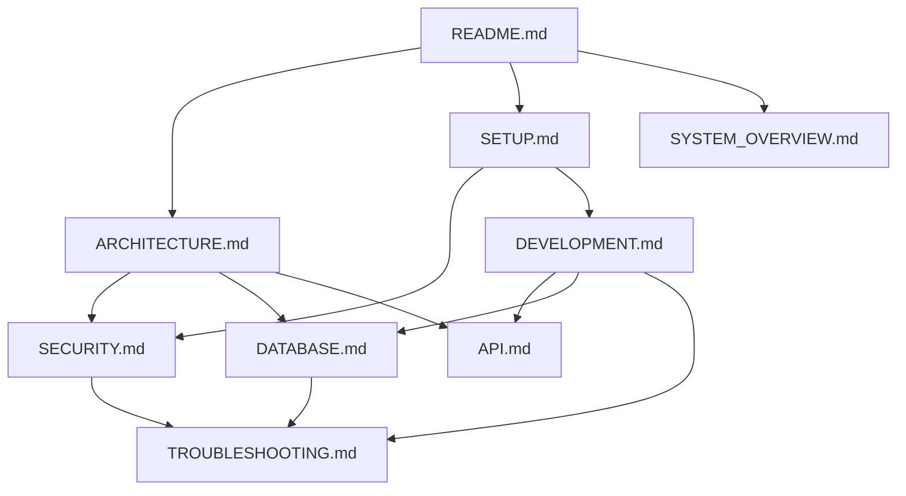

# Design Document: Technical Documentation

## Overview

This design outlines the structure and content for comprehensive technical documentation of the Visitor Management System. The documentation suite will consist of multiple interconnected documents, each serving a specific purpose for developers working with the system.

The documentation will be organized as follows:

1. **README.md** - Entry point with quick start and overview
2. **ARCHITECTURE.md** - Detailed architecture and design patterns
3. **SECURITY.md** - Security implementation and encryption details
4. **SETUP.md** - Complete setup guide for development and production
5. **API.md** - API reference documentation
6. **DEVELOPMENT.md** - Development guide and best practices
7. **DATABASE.md** - Database schema and operations
8. **TROUBLESHOOTING.md** - Common issues and solutions
9. **SYSTEM_OVERVIEW.md** (updated) - High-level system overview

Each document will be written in Markdown format with clear headings, code examples, and diagrams where appropriate. The documentation will use Mermaid for diagrams to ensure they remain version-controlled and easily editable.

## Architecture

### Documentation Structure

The documentation follows a layered approach, similar to the system's Clean Architecture:

```
Documentation Layer Structure:
├── Entry Layer (README.md)
│   └── Quick overview, links to detailed docs
├── Conceptual Layer (ARCHITECTURE.md, SYSTEM_OVERVIEW.md)
│   └── High-level understanding of system design
├── Implementation Layer (SECURITY.md, DATABASE.md, API.md)
│   └── Detailed technical specifications
└── Operational Layer (SETUP.md, DEVELOPMENT.md, TROUBLESHOOTING.md)
    └── Practical guides for working with the system
```

### Document Relationships



### Content Organization Principles

1. **Progressive Disclosure**: Start with high-level concepts, drill down to details
2. **Task-Oriented**: Organize by what developers need to accomplish
3. **Cross-Referencing**: Link related concepts across documents
4. **Code Examples**: Provide working code snippets for all procedures
5. **Visual Aids**: Use diagrams to explain complex relationships

## Components and Interfaces

### README.md

**Purpose**: Entry point for all documentation, provides quick start and navigation.

**Structure**:
```markdown
# Visitor Management System

## Overview
[Brief description of the system]

## Features
[Bullet list of key features]

## Quick Start
[Minimal steps to get running]

## Documentation
[Links to all other documentation files]

## System Requirements
[Node.js version, OS compatibility]

## Screenshots
[Visual overview of the application]

## License and Contact
```

**Key Content**:
- System description: Electron desktop app for visitor access control
- Features: Check-in/check-out, encrypted database, role-based access, reports, backups
- Quick start: `npm run install-all`, configure .env, `npm run dev`
- Links to detailed documentation
- Requirements: Node.js 18+, Windows/macOS/Linux

### ARCHITECTURE.md

**Purpose**: Explain the system's architectural patterns and component organization.

**Structure**:
```markdown
# Architecture Documentation

## Overview
[High-level architecture description]

## Clean Architecture Pattern
[Explanation of Domain, Application, Infrastructure layers]

## Layer Descriptions

### Domain Layer
[Entities, business rules]

### Application Layer
[Use cases, DTOs]

### Infrastructure Layer
[Repositories, services, external dependencies]

### Presentation Layer
[Controllers, routes, React components]

## Technology Stack
[Detailed breakdown by component]

## Component Interactions
[Diagrams showing data flow]

## Design Patterns
[Patterns used throughout the system]
```

**Key Content**:
- Clean Architecture diagram with all layers
- Dependency rule: outer layers depend on inner layers
- Domain entities: Visitor, Visit, User
- Use cases: CheckInVisitor, CheckOutVisitor, CreateBackup, etc.
- Repositories: IVisitorRepository, IVisitRepository, IUserRepository
- Infrastructure implementations: SequelizeVisitorRepository, SqliteBackupService
- Technology stack:
  - Frontend: React 18 + TypeScript + Vite + Tailwind CSS
  - Backend: Node.js + Express + TypeScript
  - Database: SQLCipher (encrypted SQLite) + Sequelize ORM
  - Desktop: Electron
  - Authentication: JWT with bcryptjs
  - Encryption: crypto module (AES-256-GCM)

### SECURITY.md

**Purpose**: Document all security implementations, encryption mechanisms, and best practices.

**Structure**:
```markdown
# Security Documentation

## Overview
[Security architecture overview]

## SQLCipher Database Encryption

### What is SQLCipher
[Explanation of SQLCipher vs SQLite]

### Key Generation
[Commands to generate encryption keys]

### Database Initialization
[How encryption is applied at startup]

### Migration from Plain SQLite
[Migration script usage]

## Field-Level Encryption

### Encrypted Fields
[List of encrypted fields and why]

### Encryption Process
[How data is encrypted/decrypted]

### Key Management
[Where keys are stored, rotation strategy]

## Backup Encryption

### Backup Format
[.sqlite.enc file structure]

### Encryption Process
[IV, AuthTag, gzip compression]

### Restore Process
[How to decrypt and restore]

## Authentication

### JWT Implementation
[Token generation, validation, expiration]

### Role-Based Access Control
[Admin, Guard, Auditor roles]

### Password Security
[Bcrypt hashing, salt rounds]

## Security Best Practices
[Recommendations for production deployment]
```

**Key Content**:
- SQLCipher uses 256-bit AES encryption
- Key generation commands:
  ```bash
  # Database encryption key (64 hex chars)
  node -e "console.log(require('crypto').randomBytes(32).toString('hex'))"
  
  # JWT secret (128 hex chars)
  node -e "console.log(require('crypto').randomBytes(64).toString('hex'))"
  
  # Field encryption key (64 hex chars)
  node -e "console.log(require('crypto').randomBytes(32).toString('hex'))"
  ```
- Encrypted fields: visitor names, email, phone, position, cedula
- Visitor ID: SHA-256 hash of cedula (used as primary key)
- Backup encryption: AES-256-GCM with random IV, includes AuthTag for integrity
- JWT: Access tokens (15m), refresh tokens (7d)
- Roles: admin (full access), guard (operations), auditor (read-only)
- Rate limiting: 100 requests/minute per IP

### SETUP.md

**Purpose**: Complete setup guide for development and production environments.

**Structure**:
```markdown
# Setup Guide

## Prerequisites
[Required software and versions]

## Development Setup

### 1. Clone Repository
[Git clone command]

### 2. Install Dependencies
[npm install-all command]

### 3. Environment Configuration
[.env file setup with all variables]

### 4. Generate Encryption Keys
[Key generation commands]

### 5. Initialize Database
[First-time database setup]

### 6. Run Development Server
[npm run dev command]

## Production Setup

### 1. Environment Configuration
[Production-specific settings]

### 2. Build Application
[npm run dist command]

### 3. Database Setup
[Production database initialization]

### 4. Security Checklist
[Production security requirements]

## Verification
[How to verify setup is correct]

## Common Setup Issues
[Troubleshooting setup problems]
```

**Key Content**:
- Prerequisites: Node.js 18+, npm 9+
- Installation: `npm run install-all` (installs root, server, client)
- .env configuration with all variables from .env.example
- Key generation for DB_ENCRYPTION_KEY, JWT_SECRET, ENCRYPTION_KEY
- Database initialization: automatic on first run with seeder
- Development: `npm run dev` (runs client and server concurrently)
- Production: `npm run dist` (builds Electron executable)
- Verification: Check http://localhost:3000/health, login with demo/demo123

### API.md

**Purpose**: Complete API reference for all endpoints.

**Structure**:
```markdown
# API Documentation

## Base URL
[http://localhost:3000/api]

## Authentication
[How to include JWT tokens]

## Endpoints

### Authentication
[POST /auth/login, /auth/refresh, etc.]

### Visitors
[GET /visitors, POST /visitors, etc.]

### Visits
[GET /visits, POST /visits/checkin, POST /visits/checkout, etc.]

### Reports
[GET /reports/stats, GET /reports/monthly, etc.]

### Backups
[GET /backups, POST /backups, POST /backups/restore]

### Audit
[GET /audit/logs]

## Error Responses
[Standard error format]

## Pagination
[How pagination works]

## Rate Limiting
[Rate limit headers and behavior]
```

**Key Content**:
- Base URL: http://localhost:3000/api
- Authentication: Bearer token in Authorization header
- Key endpoints:
  - POST /auth/login - Login with email/password
  - POST /visits/checkin - Check in visitor
  - POST /visits/checkout/:id - Check out visitor
  - GET /visits - List visits (paginated, filterable)
  - GET /visitors/by-cedula/:cedula - Get visitor by ID
  - GET /reports/stats - Get visit statistics
  - POST /backups - Create backup
  - GET /audit/logs - Get audit logs
- Pagination: page, limit, totalPages in response
- Filters: status, startDate, endDate, search
- Error format: { success: false, error: "message" }

### DEVELOPMENT.md

**Purpose**: Guide for developers adding features or maintaining the system.

**Structure**:
```markdown
# Development Guide

## Getting Started
[How to run in development mode]

## Project Structure
[Directory layout with descriptions]

## Adding a New Feature

### 1. Create Domain Entity
[How to add entity in domain/entities]

### 2. Create Repository Interface
[How to add interface in domain/repositories]

### 3. Implement Repository
[How to add implementation in infrastructure/database/repositories]

### 4. Create Use Case
[How to add use case in application/usecases]

### 5. Create Controller
[How to add controller]

### 6. Add Routes
[How to add routes]

### 7. Update Frontend
[How to add UI components]

## Coding Conventions
[Style guide and patterns]

## Testing
[How to test features]

## Database Operations
[Migrations, seeding, queries]

## Debugging
[How to debug backend and frontend]
```

**Key Content**:
- Development mode: `npm run dev` (hot reload for both client and server)
- Project structure:
  - `/server/src/domain` - Business entities and interfaces
  - `/server/src/application` - Use cases and DTOs
  - `/server/src/infrastructure` - Repositories and services
  - `/server/src/controllers` - HTTP request handlers
  - `/server/src/routes` - API route definitions
  - `/client/src/components` - React components
  - `/client/src/services` - API client
- Adding feature: Follow Clean Architecture layers (domain → application → infrastructure → presentation)
- Seeding: Automatic on startup, creates demo user and sample data
- Migrations: Use Sequelize sync with alter: true
- Debugging: Use VS Code debugger, check server/server_health.log

### DATABASE.md

**Purpose**: Document database schema, models, and operations.

**Structure**:
```markdown
# Database Documentation

## Overview
[Database technology and encryption]

## Schema

### Users Table
[Fields, types, constraints]

### Visitors Table
[Fields, types, encrypted fields]

### Visits Table
[Fields, types, relationships]

### ActivityLog Table
[Fields, types, purpose]

## Relationships
[Foreign keys and associations]

## Encrypted Fields
[Which fields are encrypted and why]

## Indexes
[Performance indexes]

## Sequelize Models
[How to use models in code]

## Migrations
[How to run migrations]

## Data Retention
[GDPR compliance, data cleanup]
```

**Key Content**:
- Database: SQLCipher (encrypted SQLite)
- Tables:
  - Users: id, email, password (bcrypt), role, name
  - Visitors: id (SHA-256 hash), encrypted_cedula, encrypted_nombre, encrypted_apellido, encrypted_email, encrypted_telefono, encrypted_cargo, empresa (plain), foto_url
  - Visits: id, visitor_id, check_in, check_out, motivo, a_quien_visita, notas, estado
  - ActivityLog: id, user_id, action, details, ip_address, timestamp
- Encrypted fields: All visitor personal data except empresa
- Relationships: Visits → Visitors (many-to-one), Visits → Users (many-to-one)
- Indexes: visitor_id, check_in, estado on Visits; action, timestamp on ActivityLog
- Models: Use Sequelize models with hooks for encryption/decryption
- Data retention: Configurable via DATA_RETENTION_DAYS (default 60 days)

### TROUBLESHOOTING.md

**Purpose**: Help developers diagnose and fix common issues.

**Structure**:
```markdown
# Troubleshooting Guide

## Encryption Issues

### "Invalid key" error
[Causes and solutions]

### "Unable to open database" error
[Causes and solutions]

### Encrypted data shows as gibberish
[Causes and solutions]

## Database Issues

### Database locked
[Causes and solutions]

### Migration errors
[Causes and solutions]

### Seeding fails
[Causes and solutions]

## Authentication Issues

### JWT token invalid
[Causes and solutions]

### Login fails with correct credentials
[Causes and solutions]

## Electron Build Issues

### Build fails on Windows
[Causes and solutions]

### App crashes on startup
[Causes and solutions]

## Performance Issues

### Slow queries
[Optimization tips]

### High memory usage
[Memory optimization]

## Diagnostic Commands
[Commands to check system health]
```

**Key Content**:
- Encryption errors:
  - "Invalid key": Check DB_ENCRYPTION_KEY matches database, regenerate if needed
  - "Unable to open database": Database may be corrupted or wrong key
  - Gibberish data: ENCRYPTION_KEY mismatch, check .env
- Database issues:
  - Locked: Close other connections, restart server
  - Migration errors: Delete database and reinitialize
  - Seeding fails: Check logs, verify encryption keys
- Authentication:
  - Invalid JWT: Token expired, check JWT_SECRET
  - Login fails: Check password hash, verify user exists
- Electron build:
  - Build fails: Check node_modules, run `npm run install-all`
  - Crashes: Check logs in dist-electron, verify .env
- Performance:
  - Slow queries: Check indexes, use pagination
  - High memory: Limit result sets, optimize images
- Diagnostics:
  - Check encryption: `npm run migrate:sqlcipher` (in server/)
  - Verify database: Check data/visits.sqlite exists
  - Test API: curl http://localhost:3000/health

### SYSTEM_OVERVIEW.md (Updated)

**Purpose**: High-level overview of the system for quick understanding.

**Structure**:
```markdown
# System Overview

## Introduction
[What the system does]

## Architecture

### Clean Architecture
[Layer description]

### Technology Stack
[Complete stack with versions]

## Security

### Database Encryption
[SQLCipher overview]

### Field Encryption
[Sensitive data protection]

### Authentication
[JWT and roles]

## Key Features
[Feature list with descriptions]

## Project Structure
[Directory layout]

## Development Workflow
[How to work with the system]
```

**Key Content**:
- Update to include Clean Architecture layers
- Add SQLCipher and field-level encryption
- Document backup encryption
- Update technology stack with current versions
- Add security section
- Update project structure to show domain/application/infrastructure

## Data Models

### Documentation Metadata

Each documentation file will include metadata for tracking:

```typescript
interface DocumentMetadata {
  title: string;           // Document title
  lastUpdated: string;     // ISO date string
  version: string;         // Semantic version
  relatedDocs: string[];   // Links to related documents
  audience: string;        // Target audience (developer, admin, etc.)
}
```

### Code Example Format

All code examples will follow this structure:

```typescript
interface CodeExample {
  language: string;        // Programming language
  description: string;     // What the code does
  code: string;           // The actual code
  output?: string;        // Expected output (if applicable)
  notes?: string;         // Additional notes or warnings
}
```

### Diagram Specifications

Diagrams will use Mermaid syntax:

```typescript
interface DiagramSpec {
  type: 'graph' | 'sequence' | 'class' | 'er';
  title: string;
  mermaidCode: string;
  description: string;
}
```

## Error Handling

### Documentation Errors

The documentation should address common errors developers encounter:

1. **Setup Errors**
   - Missing dependencies
   - Incorrect Node.js version
   - Missing .env variables
   - Invalid encryption keys

2. **Runtime Errors**
   - Database connection failures
   - Encryption/decryption errors
   - Authentication failures
   - API errors

3. **Build Errors**
   - TypeScript compilation errors
   - Electron packaging errors
   - Missing assets

Each error should include:
- Error message example
- Root cause explanation
- Step-by-step solution
- Prevention tips

### Documentation Quality Standards

All documentation must meet these standards:

1. **Accuracy**: All commands and code examples must be tested and working
2. **Completeness**: Cover all aspects of the requirement
3. **Clarity**: Use simple language, avoid jargon where possible
4. **Consistency**: Use consistent terminology and formatting
5. **Maintainability**: Easy to update when system changes
6. **Accessibility**: Clear headings, good contrast, logical structure

## Testing Strategy

### Documentation Validation

The documentation will be validated through:

1. **Technical Review**
   - Verify all commands work as documented
   - Test all code examples
   - Validate all links
   - Check diagram accuracy

2. **User Testing**
   - Have a new developer follow setup guide
   - Verify they can complete common tasks
   - Gather feedback on clarity

3. **Completeness Check**
   - Ensure all requirements are addressed
   - Verify all API endpoints are documented
   - Check all configuration options are explained

### Documentation Testing Checklist

For each document:
- [ ] All code examples are tested and working
- [ ] All commands produce expected results
- [ ] All links point to correct locations
- [ ] Diagrams accurately represent the system
- [ ] No outdated information
- [ ] Consistent formatting throughout
- [ ] Clear table of contents
- [ ] Proper cross-references

### Unit Testing for Documentation

While documentation itself isn't unit tested, the examples within it should be:

1. **Command Validation**
   - Test all npm scripts work
   - Verify all Node.js commands execute
   - Check all curl examples return expected responses

2. **Code Example Validation**
   - Extract code examples into test files
   - Run them to ensure they work
   - Verify outputs match documentation

3. **Link Validation**
   - Check all internal links resolve
   - Verify all file paths exist
   - Ensure all external links are accessible


## Correctness Properties

A property is a characteristic or behavior that should hold true across all valid executions of a system—essentially, a formal statement about what the system should do. Properties serve as the bridge between human-readable specifications and machine-verifiable correctness guarantees.

For documentation, properties verify that the documentation contains required information and maintains structural consistency. While we cannot automatically verify the quality of explanations (which requires human judgment), we can verify that specific required elements are present.

### Property 1: Environment Configuration Completeness

*For any* required environment variable (DB_ENCRYPTION_KEY, JWT_SECRET, ENCRYPTION_KEY, BACKUP_PASSWORD), the documentation SHALL contain both the variable name and a command to generate it.

**Validates: Requirements 1.3, 1.4, 3.2**

### Property 2: Architecture Component Documentation

*For any* Clean Architecture component type (Entity, Use Case, Repository, Controller), the documentation SHALL specify both its purpose and its file system location.

**Validates: Requirements 2.4, 2.7**

### Property 3: Security Feature Completeness

*For any* security feature (field-level encryption, backup encryption, role-based access control), the documentation SHALL list all specific elements of that feature (e.g., all encrypted fields, all encryption components like IV/AuthTag, all user roles).

**Validates: Requirements 3.3, 3.6, 3.8**

### Property 4: API Endpoint Documentation Structure

*For any* documented API endpoint, the documentation SHALL include the HTTP method, path, authentication requirements, request schema, and response schema.

**Validates: Requirements 4.1, 4.2, 4.3, 4.4**

### Property 5: Database Schema Completeness

*For any* database table (Users, Visitors, Visits, ActivityLog), the documentation SHALL specify which fields are encrypted and which are plain text.

**Validates: Requirements 6.1, 6.2**

### Property 6: Cross-Reference Consistency

*For any* documentation file that references another documentation file, the referenced file SHALL exist and the link SHALL be valid.

**Validates: Requirements 9.4**

### Property 7: Technology Stack Completeness

*For any* major technology used in the system (React, Express, Sequelize, SQLCipher, Electron, TypeScript, Tailwind), the documentation SHALL mention it in the technology stack section.

**Validates: Requirements 2.7, 10.5**

### Property 8: Directory Structure Documentation

*For any* key directory in the project structure (domain, application, infrastructure, controllers, routes, components), the documentation SHALL include the directory path and a description of its contents.

**Validates: Requirements 5.2**

### Property 9: Backup Process Documentation

*For any* backup encryption component (IV, AuthTag, gzip), the documentation SHALL explain its role in the backup process.

**Validates: Requirements 7.4**

Note: Many acceptance criteria require semantic understanding of explanation quality (e.g., "explain clearly", "provide adequate steps") which cannot be automatically verified through property-based testing. These criteria will be validated through manual review and user testing as described in the Testing Strategy section.
