<div align="center">

# 🏢 LogMaster

### Multi-tenant SaaS for visitor management — control de visitantes, auditoría y cumplimiento normativo

Plataforma **multi-tenant** para gestión de visitantes en organizaciones de cualquier tamaño. Cada tenant (organización) obtiene un workspace aislado con sus propios visitantes, visitas, usuarios, auditoría, respaldos y plan de suscripción. Datos personales (PII) cifrados con AES-256-GCM, auditoría inmutable, y derechos ARCO/GDPR como ciudadanos de primera clase.

</div>

<br>

<div align="center">

[](https://github.com/Suggus1899/Visitors/actions/workflows/ci.yml)
[](https://github.com/Suggus1899/Visitors/actions/workflows/security.yml)
[](./LICENSE)

</div>

<br>

<div align="center">

## 🛠️ Tech Stack

</div>

<table align="center">
<tr>
<th colspan="5" align="center" width="600"><sub><b>Frontend</b></sub></th>
</tr>
<tr>
<td align="center" width="120">
<a href="https://nextjs.org/" target="_blank"></a>
<br><sub><b><a href="https://nextjs.org/" target="_blank">Next.js 14</a></b></sub>
<br><sub>App Router · SSR</sub>
</td>
<td align="center" width="120">
<a href="https://react.dev/" target="_blank"></a>
<br><sub><b><a href="https://react.dev/" target="_blank">React 18</a></b></sub>
<br><sub>Server Components</sub>
</td>
<td align="center" width="120">
<a href="https://www.typescriptlang.org/" target="_blank"></a>
<br><sub><b><a href="https://www.typescriptlang.org/" target="_blank">TypeScript 5</a></b></sub>
<br><sub>Type-safe</sub>
</td>
<td align="center" width="120">
<a href="https://tailwindcss.com/" target="_blank"></a>
<br><sub><b><a href="https://tailwindcss.com/" target="_blank">Tailwind v3</a></b></sub>
<br><sub>Utility-first</sub>
</td>
<td align="center" width="120">
<a href="https://tanstack.com/query/latest" target="_blank"></a>
<br><sub><b><a href="https://tanstack.com/query/latest" target="_blank">TanStack Query</a></b></sub>
<br><sub>Data fetching</sub>
</td>
</tr>
<tr>
<th colspan="5" align="center" width="600"><sub><b>Backend</b></sub></th>
</tr>
<tr>
<td align="center" width="120">
<a href="https://nodejs.org/" target="_blank"></a>
<br><sub><b><a href="https://nodejs.org/" target="_blank">Node.js 20</a></b></sub>
<br><sub>Runtime</sub>
</td>
<td align="center" width="120">
<a href="https://expressjs.com/" target="_blank"></a>
<br><sub><b><a href="https://expressjs.com/" target="_blank">Express 4</a></b></sub>
<br><sub>HTTP framework</sub>
</td>
<td align="center" width="120">
<a href="https://sequelize.org/" target="_blank"></a>
<br><sub><b><a href="https://sequelize.org/" target="_blank">Sequelize 6</a></b></sub>
<br><sub>ORM</sub>
</td>
<td align="center" width="120">
<a href="https://www.postgresql.org/" target="_blank"></a>
<br><sub><b><a href="https://www.postgresql.org/" target="_blank">PostgreSQL 16</a></b></sub>
<br><sub>Primary DB</sub>
</td>
<td align="center" width="120">
<a href="https://zod.dev/" target="_blank"></a>
<br><sub><b><a href="https://zod.dev/" target="_blank">Zod</a></b></sub>
<br><sub>Schema validation</sub>
</td>
</tr>
<tr>
<th colspan="5" align="center" width="600"><sub><b>Security & Auth</b></sub></th>
</tr>
<tr>
<td align="center" width="120">
<a href="https://jwt.io/" target="_blank"></a>
<br><sub><b><a href="https://jwt.io/" target="_blank">JWT</a></b></sub>
<br><sub>HS256 · 15m / 7d</sub>
</td>
<td align="center" width="120">
<a href="https://github.com/kelektiv/node.bcrypt.js" target="_blank"></a>
<br><sub><b><a href="https://github.com/kelektiv/node.bcrypt.js" target="_blank">bcrypt</a></b></sub>
<br><sub>Password hashing</sub>
</td>
<td align="center" width="120">
<a href="https://helmetjs.github.io/" target="_blank"></a>
<br><sub><b><a href="https://helmetjs.github.io/" target="_blank">Helmet</a></b></sub>
<br><sub>HTTP headers</sub>
</td>
<td align="center" width="120">
<a href="https://express-rate-limit.mintlify.app/" target="_blank"></a>
<br><sub><b><a href="https://express-rate-limit.mintlify.app/" target="_blank">rate-limit</a></b></sub>
<br><sub>9 limiters</sub>
</td>
<td align="center" width="120">
<a href="https://nodejs.org/api/crypto.html" target="_blank"></a>
<br><sub><b><a href="https://nodejs.org/api/crypto.html" target="_blank">AES-256-GCM</a></b></sub>
<br><sub>PII encryption</sub>
</td>
</tr>
<tr>
<th colspan="5" align="center" width="600"><sub><b>Tooling & Infra</b></sub></th>
</tr>
<tr>
<td align="center" width="120">
<a href="https://pnpm.io/" target="_blank"></a>
<br><sub><b><a href="https://pnpm.io/" target="_blank">pnpm 11</a></b></sub>
<br><sub>Workspaces</sub>
</td>
<td align="center" width="120">
<a href="https://turbo.build/repo" target="_blank"></a>
<br><sub><b><a href="https://turbo.build/repo" target="_blank">Turborepo</a></b></sub>
<br><sub>Build system</sub>
</td>
<td align="center" width="120">
<a href="https://www.docker.com/" target="_blank"></a>
<br><sub><b><a href="https://www.docker.com/" target="_blank">Docker</a></b></sub>
<br><sub>7 services</sub>
</td>
<td align="center" width="120">
<a href="https://vitest.dev/" target="_blank"></a>
<br><sub><b><a href="https://vitest.dev/" target="_blank">Vitest</a></b></sub>
<br><sub>Unit + integration</sub>
</td>
<td align="center" width="120">
<a href="https://playwright.dev/" target="_blank"></a>
<br><sub><b><a href="https://playwright.dev/" target="_blank">Playwright</a></b></sub>
<br><sub>E2E · 39 tests</sub>
</td>
</tr>
</table>

<br>

## 📐 Arquitectura

```mermaid
flowchart LR
  subgraph Clients["Clients (Browser)"]
    L["Landing<br/>(marketing)"]
    P["Platform<br/>(superadmin)"]
    A["Admin<br/>(tenant admin)"]
    AU["Auditor<br/>(tenant auditor)"]
    S["System<br/>(guard / reception)"]
  end

  subgraph Apps["Frontend Apps"]
    direction TB
    appsLanding["apps/landing :5173<br/>Next.js 14 · SSR"]
    appsPlatform["apps/platform :5174<br/>Vite → Next (pending)"]
    appsAdmin["apps/admin :5175<br/>Vite → Next (pending)"]
    appsAuditor["apps/auditor :5176<br/>Vite → Next (pending)"]
    appsSystem["apps/system :5177<br/>Vite → Next (pending)"]
  end

  subgraph Backend["Backend (Node + Express — Hexagonal)"]
    direction TB
    Routes["Routes / Controllers<br/>(interface layer)"]
    UC["Use Cases<br/>(application layer)"]
    Domain["Domain Entities<br>& Repository Interfaces"]
    Repos["Sequelize Repositories<br/>(infrastructure layer)"]
    Routes --> UC --> Domain
    UC --> Repos
  end

  DB[("PostgreSQL 16<br/>(tenantId-scoped tables<br/>+ PII encryption)")]

  Clients --> Apps
  Apps -->|"REST / SSE :3001<br/>cookie + header auth"| Routes
  Repos --> DB
```



> Para el deep-dive de arquitectura (capas hexagonales, multi-tenancy, auth flows, subscription enforcement, backups, SSE, shared package graph) ver **[docs/ARCHITECTURE.md](./docs/ARCHITECTURE.md)**.

## 📱 Aplicaciones

| App | Descripción | Puerto | Rol | Estado migración Next |
|-----|-------------|--------|-----|----------------------|
| **landing** | Landing page pública — marketing, features, pricing, demo self-service | 5173 | PUBLIC | ✅ Next.js 14 |
| **platform** | Consola superadmin — tenant CRUD, user management, MRR, global stats | 5174 | ROOT | ⏳ Vite (pending) |
| **admin** | Backoffice del tenant — visitas, visitantes, calendario, reportes, backups | 5175 | ADMIN | ⏳ Vite (pending) |
| **auditor** | Vista del auditor — logs, ARCO, compliance, exportación | 5176 | AUDITOR | ⏳ Vite (pending) |
| **system** | Recepción / guardia — check-in, webcam, SSE en vivo | 5177 | OPERADOR | ⏳ Vite (pending) |

## 📦 Estructura del Monorepo

```
logmaster/
├── apps/
│   ├── landing/           ← Next.js 14 App Router (SSR)
│   ├── platform/          ← Vite SPA → Next (pending)
│   ├── admin/             ← Vite SPA → Next (pending)
│   ├── auditor/           ← Vite SPA → Next (pending)
│   └── system/            ← Vite SPA → Next (pending)
│
├── packages/
│   ├── ui/                ← @logmaster/ui shared components
│   ├── api/               ← @logmaster/api API client
│   ├── auth/              ← @logmaster/auth auth helpers
│   ├── types/             ← @logmaster/types shared types
│   ├── utils/             ← @logmaster/utils shared utilities
│   └── config/            ← @logmaster/config shared config
│
├── server/                ← Express backend (hexagonal)
│   ├── src/
│   │   ├── application/   ← Use cases + DTOs
│   │   ├── domain/        ← Entities + repository interfaces
│   │   ├── infrastructure/← Sequelize repos + services
│   │   ├── controllers/   ← Interface layer
│   │   ├── routes/        ← Express routes
│   │   ├── middleware/    ← auth, firewall, rate-limit, sanitize
│   │   ├── schemas/       ← Zod validation
│   │   ├── models/        ← Sequelize models
│   │   └── migrations/    ← SQL migrations (001-012)
│   └── package.json
│
├── e2e/                   ← Playwright E2E tests (39 tests)
├── .github/workflows/     ← CI (ci, deploy, security, pr)
├── docker-compose.yml     ← 7 services (postgres, server, 5 apps)
├── pnpm-workspace.yaml    ← Workspace definition
└── turbo.json             ← Turborepo pipeline
```

## 🚀 Quick Start

### Prerrequisitos

| Herramienta | Versión | Instalación |
|-------------|---------|-------------|
| Node.js | 20+ | [nodejs.org](https://nodejs.org/) |
| pnpm | 11+ | `npm install -g pnpm` |
| PostgreSQL | 16+ | [postgresql.org](https://www.postgresql.org/download/) |
| Docker | 24+ (opcional) | [docker.com](https://www.docker.com/) |

### 1. Clonar e instalar

```bash
git clone https://github.com/Suggus1899/Visitors.git
cd Visitors
pnpm install
```

### 2. Configurar entorno

```bash
cp .env.example .env
# Editar .env con tus credenciales de PostgreSQL y secrets
# Obligatorios: JWT_SECRET (min 32 chars), ENCRYPTION_KEY (64 hex chars), DB_PASSWORD
```

### 3. Base de datos

```bash
# Crear DB
createdb visitors

# Migraciones + seed
pnpm db:setup    # = db:migrate && db:seed
```

### 4. Levantar todo (hot reload)

```bash
pnpm dev         # server (:3001) + 5 apps en paralelo via turbo
```

### 5. Apps individuales

```bash
pnpm dev:server     # → http://localhost:3001
pnpm dev:landing    # → http://localhost:5173
pnpm dev:platform   # → http://localhost:5174
pnpm dev:admin      # → http://localhost:5175
pnpm dev:auditor    # → http://localhost:5176
pnpm dev:system     # → http://localhost:5177
```

### 6. Docker (opcional)

```bash
docker compose up -d --build
# postgres :5432, server :3001, landing :8080, platform :8081,
# admin :8082, auditor :8083, system :8084
```

## 📜 Licencia

**© 2026 Gustavo Colina (@Suggus1899). Todos los derechos reservados.**

Este software y su código fuente son **propiedad exclusiva** de Gustavo Colina (@Suggus1899).

- **No** está permitido copiar, modificar, distribuir, sublicenciar ni usar este código, total o parcialmente, sin autorización expresa y por escrito del autor.
- **No** está permitido usar este código con fines comerciales ni privados sin una licencia válida.
- Cualquier uso no autorizado constituye una violación de los derechos de autor y será perseguido conforme a la ley.

**Este es un software propietario. No es código abierto (open source) ni software libre.**

Ver [LICENSE](./LICENSE) para el texto completo.

---

<div align="center">

<sub>Hecho con ❤️ para gestión profesional de visitantes</sub>

</div>
