# LogMaster

> Multi-tenant SaaS platform for visitor management — control de visitantes, calendario, auditoría, cumplimiento normativo (GDPR / Ley 25.326), respaldos cifrados y suscripciones por plan.

[](https://github.com/Suggus1899/Visitors/actions/workflows/ci.yml)
[](https://github.com/Suggus1899/Visitors/actions/workflows/security.yml)
[](https://nodejs.org/)
[](https://pnpm.io/)
[](https://www.postgresql.org/)
[](https://www.typescriptlang.org/)
[](./LICENSE)

---

## What is LogMaster?

LogMaster is a multi-tenant SaaS application for managing visitor access in organizations of any size. Each tenant (organization) gets an isolated workspace with its own visitors, visits, users, audit trail, backups, and subscription plan. The platform exposes a role-based access model (admin, operador, auditor, demo) plus a global superadmin layer for platform operators. Sensitive personal data (PII) is encrypted at rest with AES-256-GCM, every action is audit-logged, and ARCO/GDPR rights are first-class features.

## Key Features

- **Multi-tenant isolation** — every record carries a `tenantId`; JWT tokens carry tenant context (`tid`, `tslug`, `role`) and every query is scoped.
- **Visitor management** — CRUD with photo and ID-photo capture (stored as BLOBs), company directory, edit history with PII encryption.
- **Visit lifecycle** — check-in, waiting → admit, active → intermittent (temporary exit / re-entry), check-out, reactivation, missed-checkout alerts.
- **Calendar** — subscription-gated calendar of scheduled visits.
- **Audit trail** — immutable `ActivityLogs` with IP, user-agent, method, path, status code, duration, severity; exportable to CSV.
- **Privacy / ARCO** — access, rectification, cancellation, and opposition requests (GDPR / Ley 25.326 Argentina).
- **Backups** — encrypted PostgreSQL dumps (`pg_dump` + AES-256-GCM) with one-time restore passwords, per-tenant and global, scheduled retention.
- **Subscriptions** — `free`, `starter`, `professional`, `enterprise` plans with per-plan limits (visits/month, users, visitors, roles) and feature flags.
- **Real-time** — Server-Sent Events (SSE) for visit updates, tenant-filtered.
- **Security** — PII encryption at rest, JWT access + refresh tokens, token blacklist, rate limiting, application firewall, Helmet headers, CORS allow-list.
- **Platform admin** — superadmin console for tenant CRUD, user management, subscription changes, global stats, revenue (MRR) calculation, and cascade delete.
- **Demo tenants** — self-service demo creation with 3 pre-provisioned users and seed data, time-limited and isolated.

## Architecture Overview

LogMaster is a pnpm 11 monorepo with a hexagonal (ports & adapters) backend and five React + Vite frontend apps backed by six shared packages.

```mermaid
flowchart LR
  subgraph Clients["Clients (Browser)"]
    L["Landing<br/>(marketing)"]
    P["Platform<br/>(superadmin)"]
    A["Admin<br/>(tenant admin)"]
    AU["Auditor<br/>(tenant auditor)"]
    S["System<br/>(guard / reception)"]
  end

  subgraph Apps["Frontend Apps (Vite + React + TS + Tailwind)"]
    direction TB
    appsLanding["apps/landing :5173"]
    appsPlatform["apps/platform :5174"]
    appsAdmin["apps/admin :5175"]
    appsAuditor["apps/auditor :5176"]
    appsSystem["apps/system :5177"]
  end

  subgraph Backend["Backend (Node + Express + TS — Hexagonal)"]
    direction TB
    Routes["Routes / Controllers<br/>(interface layer)"]
    UC["Use Cases<br/>(application layer)"]
    Domain["Domain Entities<br>& Repository Interfaces"]
    Repos["Sequelize Repositories<br/>(infrastructure layer)"]
    Routes --> UC --> Domain
    UC --> Repos
  end

  DB[("PostgreSQL 16<br/>(tenantId-scoped tables<br/>+ PII encryption)")]

  Clients --> Apps
  Apps -->|"REST / SSE :3001"| Routes
  Repos --> DB
```



> For the full architecture deep-dive (hexagonal layers, multi-tenancy model, auth flows, subscription enforcement, backups, SSE, shared package graph) see **[docs/ARCHITECTURE.md](./docs/ARCHITECTURE.md)**.

## Tech Stack

| Layer        | Technology                                                       |
| ------------ | ---------------------------------------------------------------- |
| Frontend     | React 18, TypeScript, Vite, Tailwind CSS, React Router, TanStack Query, Chart.js, react-big-calendar |
| Backend      | Node.js 20, Express, TypeScript, Sequelize 6, Zod (validation)   |
| Database     | PostgreSQL 16                                                    |
| Auth         | JWT (access 15m + refresh 7d), bcrypt, token blacklist           |
| Security     | AES-256-GCM PII encryption, Helmet, CORS, express-rate-limit, application firewall |
| Real-time    | Server-Sent Events (SSE)                                         |
| Backups      | `pg_dump` + AES-256-GCM encryption, node-cron scheduler          |
| Monorepo     | pnpm 11 workspaces + Turborepo                                   |
| CI/CD        | GitHub Actions (ci, deploy, security, pr workflows)              |
| Container    | Docker / Docker Compose (7 services)                             |
| Testing      | Vitest (server + apps/system), Supertest (integration), Playwright (E2E) |

## Quick Start

```bash
# 1. Clone
git clone https://github.com/Suggus1899/Visitors.git
cd Visitors

# 2. Install all dependencies (root, apps, packages, server)
pnpm install:all

# 3. Configure environment
cp .env.example .env   # then edit .env (DB_PASSWORD, JWT_SECRET, ENCRYPTION_KEY)

# 4. Create the database and run migrations + seed
createdb -U postgres visitors
pnpm db:setup

# 5. Start everything (server + all apps, hot reload)
pnpm dev
```

Open the app you need (see ports table below). For the full local-dev guide (troubleshooting, individual services, testing, linting) see **[LOCAL_DEV.md](./LOCAL_DEV.md)**.

## Project Structure

```
Visitors/
├── apps/                       # Frontend applications (Vite + React + TS)
│   ├── landing/                #   Public marketing site      (port 5173)
│   ├── platform/               #   Superadmin console         (port 5174)
│   ├── admin/                  #   Tenant admin dashboard     (port 5175)
│   ├── auditor/                #   Tenant auditor console     (port 5176)
│   └── system/                 #   Guard / reception kiosk    (port 5177)
├── packages/                   # Shared workspace packages
│   ├── ui/                     #   Shared UI components
│   ├── api/                    #   API client (axios + react-query)
│   ├── auth/                   #   Auth hooks and context
│   ├── types/                  #   Shared TypeScript types
│   ├── utils/                  #   Shared utilities
│   └── config/                 #   Shared config (Tailwind, etc.)
├── server/                     # Backend (Node + Express + Sequelize + TS)
│   ├── src/
│   │   ├── config/             #   AppConfig, logger, subscription plans, swagger, umzug
│   │   ├── controllers/        #   HTTP controllers (interface layer)
│   │   ├── domain/             #   Entities, repository interfaces, domain services
│   │   ├── application/        #   Use cases, DTOs, mappers
│   │   ├── infrastructure/     #   Sequelize repos, JwtAuth, Email, Backup, EventEmitter, TokenBlacklist
│   │   ├── middleware/         #   auth, auditor, rateLimiter, subscriptionGuard, firewall, validate, error
│   │   ├── models/             #   Sequelize models (Tenant, TenantUser, User, Visitor, Visit, ActivityLog, ...)
│   │   ├── routes/             #   Route definitions (clean architecture)
│   │   ├── schemas/            #   Zod validation schemas
│   │   ├── scripts/            #   DB scripts (migrate, seed, reset)
│   │   ├── services/           #   UsageCounterService
│   │   ├── shared/             #   DI Container, ApiResponse, errors
│   │   ├── utils/              #   Encryption, detectImageType, backupScheduler, retention, seeder
│   │   └── server.ts           #   Entry point
│   ├── Dockerfile
│   └── package.json
├── e2e/                        # Playwright E2E tests (39 tests across all apps)
├── .github/workflows/          # CI, deploy, security, pr workflows
├── docs/                       # Project documentation (4 files)
├── docker-compose.yml          # Production compose (7 services)
├── docker-compose.dev.yml      # Dev override with hot reload
├── pnpm-workspace.yaml         # pnpm workspace config (apps/*, packages/*)
├── turbo.json                  # Turborepo pipeline (dev, build, test, lint, typecheck)
├── LOCAL_DEV.md                # Complete local development guide
├── .env.example                # Environment variable template
└── package.json                # Root scripts and devDependencies
```

## Apps

| App | Port (dev) | Port (Docker) | Role required | Purpose | Key features | How to run |
| --- | ---------- | ------------- | ------------- | ------- | ------------ | ---------- |
| `apps/landing` | 5173 | 8080 | Public (none) | Marketing landing page with demo signup CTA | Hero section, feature highlights, pricing table, demo signup | `pnpm dev:landing` |
| `apps/platform` | 5174 | 8081 | `root` (superadmin) | Platform operator console — tenant CRUD, users, subscriptions, global stats | Tenant management, tenant user CRUD, subscription management, global users, stats/MRR, audit logs, settings | `pnpm dev:platform` |
| `apps/admin` | 5175 | 8082 | `admin` (tenant) | Tenant admin dashboard — visitors, reports, backups, ARCO | Visitor management, visit monitoring, reports (PDF/Excel), calendar, backup management, ARCO, subscription dashboard | `pnpm dev:admin` |
| `apps/auditor` | 5176 | 8083 | `auditor` (tenant) | Tenant auditor console — read-only audit logs, ARCO, exports | Audit log viewer with filters + CSV export, audit stats, ARCO list/status, data subject access, read-only (enforced by `denyAuditorOnly`) | `pnpm dev:auditor` |
| `apps/system` | 5177 | 8084 | `operador` (tenant) | Guard/reception kiosk — check-in, check-out, webcam photo capture | Visitor check-in with consent, webcam photo capture (react-webcam), visitor lookup by cedula, visit lifecycle (admit, intermittent, reactivate), real-time SSE, onboarding tour, Vitest tests | `pnpm dev:system` |

> The backend API runs on port **3001**. All frontend apps proxy `/api` to the API during development.

## Backend (server/)

The LogMaster backend is a Node.js 20 + Express + TypeScript application using Sequelize 6 with PostgreSQL 16, following hexagonal (ports & adapters) architecture.

| | |
|---|---|
| **Port** | 3001 |
| **Runtime** | Node.js 20 |
| **Framework** | Express 4 |
| **ORM** | Sequelize 6 |
| **Database** | PostgreSQL 16 |
| **Validation** | Zod |
| **Testing** | Vitest + Supertest |

> The `server/` directory is **not** part of the pnpm workspace (`pnpm-workspace.yaml` only includes `apps/*` and `packages/*`). Root scripts invoke it via `pnpm --dir server`.

### Hexagonal architecture

Dependencies point inward only: **interface → application → domain ← infrastructure**. The domain layer has zero framework imports.

| Layer | Location | Responsibility |
| ----- | -------- | -------------- |
| **Domain** | `server/src/domain/` | Pure entities (`User`, `Tenant`, `TenantUser`, `Visitor`, `Visit`), repository interfaces, domain services (`IAuthService`, `IBackupService`, `IEventEmitter`, `PasswordPolicy`). No framework imports. |
| **Application** | `server/src/application/` | Use cases, DTOs, mappers. Each use case orchestrates domain entities via repository interfaces. |
| **Infrastructure** | `server/src/infrastructure/` | Sequelize repositories, `JwtAuthService`, `EmailService`, `PostgresBackupService`, `EventEmitterService`, `TokenBlacklist`. Sequelize models live in `server/src/models/`. |
| **Interface** | `server/src/controllers/`, `server/src/routes/` | HTTP controllers translate Express requests into use-case calls via `shared/ApiResponse`. Routes wire middleware chains. |

A singleton `Container` (`server/src/shared/Container.ts`) wires interfaces to concrete implementations and constructs use cases with their dependencies.

### Run / build

```bash
# Development (hot reload)
pnpm dev:server                         # from repo root
pnpm --dir server run dev               # directly (nodemon + ts-node)

# Production
pnpm --dir server run build             # tsc -> server/dist/
pnpm --dir server run start             # node dist/server.js
```

### Database

```bash
pnpm --dir server run db:migrate        # Run pending migrations (Umzug)
pnpm --dir server run db:seed           # Seed users + demo data
pnpm --dir server run db:setup          # Migrate + seed
pnpm --dir server run db:reset          # Drop & recreate all tables, then seed (DESTRUCTIVE)
```

The seeder (`server/src/utils/seeder.ts`) creates a `default` tenant (enterprise plan) and seed users: `Admin` (admin), `operador`, `guard` (operador), `auditor`, `demo`, `trebolmaster` (root). Passwords come from `SEED_*_PASSWORD` env vars.

**Sequelize models:**

| Model | Table | Tenant-scoped |
| ----- | ----- | ------------- |
| `Tenant` | `Tenants` | — (is the tenant) |
| `TenantUser` | `TenantUsers` | join table |
| `User` | `Users` | global |
| `Visitor` | `Visitors` | yes (`tenantId`) |
| `Visit` | `Visits` | yes (`tenantId`) |
| `ActivityLog` | `ActivityLogs` | yes (`tenantId`) |
| `ArcoRequest` | `ArcoRequests` | yes (`tenantId`) |
| `VisitorEditHistory` | `VisitorEditHistories` | yes (`tenantId`) |
| `IntermittentLog` | `IntermittentLogs` | yes (`tenantId`) |

### Environment variables

The server loads `.env` from the **project root**. See [.env.example](./.env.example) and [docs/DEPLOYMENT.md](./docs/DEPLOYMENT.md#environment-variables) for the complete list.

Required in all environments: `JWT_SECRET` (min 32 chars).
Required in production: `DB_PASSWORD`, `ENCRYPTION_KEY` or `PII_ENCRYPTION_KEY` (64 hex chars).

### Backend API overview

The API is split into three route groups:

| Group | Prefix | Auth |
| ----- | ------ | ---- |
| Auth (public) | `/api/v1/auth/*` | Public (rate-limited); `change-password` requires `verifyToken` |
| Tenant-scoped | `/api/v1/:tenantSlug/*` | `verifyToken` → `resolveTenant` → `verifyTenantMembership` |
| Platform (superadmin) | `/platform/v1/*` | `adminLimiter` + `verifyToken` + `isSuperAdmin` |

Interactive Swagger UI is available at `/api-docs` in non-production environments. The full API reference is at **[docs/API.md](./docs/API.md)**.

### Testing

```bash
pnpm --dir server run test              # Run all server tests
pnpm --dir server run test:watch        # Watch mode
pnpm --dir server run test:coverage     # Coverage report
```

Test structure (`server/src/__tests__/`): `unit/` (use cases, services, utilities), `integration/` (API endpoints via Supertest), `middleware/`, `security/` (cross-tenant isolation), `helpers/`.

## Contributing

Contributions are welcome. This section covers development setup, code style, commit conventions, branch strategy, PR process, testing requirements, and architecture/multi-tenancy/security guidelines.

> For local development setup see **[LOCAL_DEV.md](./LOCAL_DEV.md)**. For architecture see **[docs/ARCHITECTURE.md](./docs/ARCHITECTURE.md)**.

### Development setup

```bash
pnpm install:all
cp .env.example .env   # edit .env
createdb -U postgres visitors
pnpm db:setup
pnpm dev
```

### Code style

- **Language**: TypeScript everywhere (strict mode in `tsconfig.json`).
- **Linting**: ESLint for `apps/landing`, `apps/platform`, `apps/system`. `apps/admin` and `apps/auditor` use `tsc --noEmit` as a fallback lint. The server uses `tsc --noEmit`.
- **Formatting**: 2-space indentation, single quotes, trailing commas.
- **Naming**: `camelCase` for variables/functions, `PascalCase` for classes/types/interfaces, `UPPER_SNAKE_CASE` for constants.
- **No `any`**: avoid `any` in new code; use proper types or generics.

```bash
pnpm lint         # Lint everything (turbo + server)
pnpm typecheck    # Type-check everything (turbo + server)
```

### Commit conventions

This project uses **Conventional Commits**:

```
<type>(<scope>): <subject>

<body>
```

| Type | Description |
| ---- | ----------- |
| `feat` | A new feature |
| `fix` | A bug fix |
| `docs` | Documentation only |
| `style` | Code style (formatting, no logic change) |
| `refactor` | Code refactoring (no feature, no fix) |
| `perf` | Performance improvement |
| `test` | Adding or fixing tests |
| `chore` | Build, tooling, dependencies |
| `security` | Security fix |

> **Do not add "Co-Authored-By" or AI attribution to commits.**

### Branch strategy

- **`main`** — production-ready code. PRs merge here after review and CI passes.
- **`develop`** — integration branch for the next release.
- **Feature branches**: `feat/<short-description>`, `fix/<short-description>`, `docs/<short-description>`.
- **Hotfix branches**: `hotfix/<short-description>` (branch from `main`, merge back to `main` and `develop`).

### PR process

1. Create a feature branch from `main` or `develop`.
2. Write code following the architecture and security guidelines below.
3. Add/update tests — see Testing Requirements.
4. Run locally: `pnpm lint && pnpm typecheck && pnpm test && pnpm build`.
5. Open a Pull Request with a clear description: what changed, why, and how it was tested.
6. CI checks (`.github/workflows/pr.yml`) must pass: lint, typecheck, build, test, security audit.
7. Code review — at least one approval required before merge.
8. Squash merge into the target branch.

### Testing requirements

- **Server**: all new use cases, controllers, and middleware must have unit tests (`server/src/__tests__/unit/`). New endpoints should have integration tests (`server/src/__tests__/integration/`). Security-sensitive changes require security tests (`server/src/__tests__/security/`).
- **System app**: has Vitest configured (`apps/system`). Add component tests for new UI features.
- **Other apps**: no test runner configured yet; manual testing is expected.
- **Cross-tenant**: any change to tenant-scoped logic must include a test verifying cross-tenant access is blocked.

### Architecture guidelines

The backend follows hexagonal architecture. Respect the dependency rule: **dependencies point inward only**.

- **Domain layer** (`server/src/domain/`) — zero imports from infrastructure, Express, Sequelize, or any framework. Only pure entities, repository interfaces, and domain services.
- **Application layer** (`server/src/application/`) — depends on domain interfaces, never on concrete Sequelize models or Express. Use cases receive dependencies via constructor injection.
- **Infrastructure layer** (`server/src/infrastructure/`) — implements domain interfaces. Sequelize models live in `server/src/models/` and are wrapped by repositories.
- **Interface layer** (`server/src/controllers/`, `server/src/routes/`) — translates HTTP to use-case calls. Controllers should be thin — no business logic.
- **DI Container** (`server/src/shared/Container.ts`) — wires everything. Register new repositories and use cases here.

**Adding a new feature:**

1. Define or extend a domain entity (`server/src/domain/entities/`).
2. Define a repository interface (`server/src/domain/repositories/`) if new data access is needed.
3. Implement the Sequelize repository (`server/src/infrastructure/database/repositories/`).
4. Write a use case (`server/src/application/usecases/`) that orchestrates the domain via interfaces.
5. Add a controller method (`server/src/controllers/`) that calls the use case.
6. Add a route (`server/src/routes/`) with the appropriate middleware chain.
7. Add a Zod schema (`server/src/schemas/`) for request validation.
8. Register the use case in the Container.
9. Write tests (unit + integration).

### Multi-tenancy rules

These rules are **non-negotiable** — violating them creates data leaks.

1. **Every tenant-scoped query must filter by `tenantId`.** Never write a repository method that queries without a `tenantId` parameter.
2. **Never trust user input for `tenantId`.** The `tenantId` always comes from the JWT (`req.user.tid`), set by `resolveTenant` middleware — never from the request body or query.
3. **Every new model must have a `tenantId` column** with a foreign key to `Tenants.id`, `allowNull: false`.
4. **Composite unique constraints must include `tenantId`** (e.g. `(tenantId, cedula)`) so the same natural key can exist across tenants.
5. **Audit logs must carry `tenantId`** so platform admins can filter by tenant.
6. **SSE events must be tenant-filtered.** The `send` function in `events.routes.ts` drops events whose `tenantId` doesn't match the connection's scope.
7. **Test cross-tenant isolation.** Add a security test that verifies a user in tenant A cannot access tenant B's data.

### Security guidelines

1. **Encrypt PII.** Any field containing personal data (cedula, names, email, phone, job_title) must be encrypted via the `Encryption` utility and a `beforeSave` model hook. Add new PII fields to the `PII_EDIT_FIELDS` set if they appear in edit history.
2. **Hash identifiers for lookup.** Use `Encryption.hash()` (SHA-256) for fields that need to be searched (e.g. `cedula`), and store the ciphertext alongside for decryption.
3. **Rate-limit sensitive endpoints.** Apply the appropriate limiter (`authLimiter`, `refreshLimiter`, `demoLimiter`, `passwordResetLimiter`, `adminLimiter`) to new endpoints that handle auth, mutations, or resource creation.
4. **Audit-log all mutations.** Every create/update/delete action must write an `ActivityLog` entry with the user, action, entity, IP, and user-agent.
5. **Validate all input.** Use Zod schemas (`server/src/schemas/`) for every request body and query. Never pass raw `req.body` to a use case.
6. **Never log secrets.** Do not log passwords, tokens, encryption keys, or PII. Winston is configured to redact known sensitive fields.
7. **Use the middleware chain.** Tenant-scoped routes must use `[verifyToken, resolveTenant, verifyTenantMembership]`. Platform routes must use `[adminLimiter, verifyToken, isSuperAdmin]`.
8. **Run `pnpm audit`** before merging. The `security.yml` CI workflow runs this on PRs.

## Changelog

### v1.0.0 — 2026 — Multi-Tenant SaaS Refactor (Waves 1–3)

Initial multi-tenant SaaS release. Refactor from a single-tenant visitor management app to a full multi-tenant SaaS platform with subscriptions, platform admin console, demo tenants, and enhanced security.

**Wave 1 — Multi-Tenancy Foundation:**
- Added `Tenant` and `TenantUser` models with `tenantId` propagation to all tenant-scoped tables.
- Added JWT tenant context (`tid`, `tslug`, `role`) in access tokens.
- Added middleware chain: `verifyToken` → `resolveTenant` → `verifyTenantMembership` for all tenant-scoped routes.
- Added tenant selection flow: `GET /v1/auth/tenants`, `POST /v1/auth/select-tenant`.
- Added composite unique constraints: `Visitors(tenantId, cedula)`, `TenantUsers(userId, tenantId)`.
- Changed refresh token to carry no tenant context (revalidated on refresh).
- Changed all Sequelize repositories to filter by `tenantId` on every query.

**Wave 2 — Subscriptions, Platform Admin, Backups:**
- Added subscription plans (`free`, `starter`, `professional`, `enterprise`) with per-plan limits and feature flags.
- Added `UsageCounterService` for real-time usage tracking and limit enforcement.
- Added `subscriptionGuard` middleware for feature-gated routes (calendar, auditor, backup-on-demand).
- Added platform admin API (`/platform/v1/*`) with 28 endpoints: tenant CRUD, tenant users, subscriptions, global users, stats, audit logs, settings.
- Added `isSuperAdmin` middleware and `root` role for platform operators.
- Added revenue/MRR calculation via `PLAN_PRICES` (free=0, starter=29, professional=79, enterprise=299).
- Added per-tenant encrypted backups (`PostgresBackupService`) with one-time restore passwords.
- Added backup scheduler with per-plan frequency and retention.

**Wave 3 — Demo Tenants, Security Hardening, Real-Time:**
- Added self-service demo tenant creation (`POST /v1/auth/demo`) with 3 pre-provisioned users and seed data.
- Added demo tenant isolation: `isDemo` flag, `demoExpiresAt` (7 days), expiry enforcement in `resolveTenant`.
- Added PII encryption for edit history (`PII_EDIT_FIELDS`).
- Added photo content-type detection from magic bytes (`detectImageType.ts`).
- Added Server-Sent Events for real-time visit updates with tenant-filtered event delivery.
- Added application firewall middleware (IP blocking, suspicious UA/path detection, attack-pattern scanning).
- Added Helmet security headers, CORS allow-list, `mustChangePassword` middleware, password policy, account lockout, token blacklist.
- Added ARCO privacy endpoints for GDPR / Ley 25.326 compliance.
- Added Swagger UI at `/api-docs` (disabled in production).

**Monorepo & Tooling:**
- Added pnpm 11 workspace with Turborepo.
- Added 5 frontend apps: `landing` (5173), `platform` (5174), `admin` (5175), `auditor` (5176), `system` (5177).
- Added 6 shared packages: `@logmaster/{ui,api,auth,types,utils,config}`.
- Added Docker Compose (7 services) with dev override for hot reload.
- Added GitHub Actions CI/CD: `ci.yml`, `deploy.yml`, `security.yml`, `pr.yml`.
- Added Vitest test suite (321 tests) covering unit, integration, and security (cross-tenant isolation).
- Added Zod validation schemas for all request bodies and queries.
- Added hexagonal architecture refactor: domain entities, repository interfaces, use cases, DI container.

**Known limitations (at release):**
- Demo-specific per-tenant rate limiter deferred (documented as TODO in `auth.ts`).
- Token blacklist and rate limiter stores are in-memory (single-server only).
- No automated PII key rotation.
- No payment provider integration (`PLAN_PRICES` are static for MRR estimation).

## Deployment

LogMaster ships with Docker Compose for production (7 services: postgres, server, landing, platform, admin, auditor, system). See **[docs/DEPLOYMENT.md](./docs/DEPLOYMENT.md)** for prerequisites, environment variables, SSL/TLS, monitoring, scaling, and the update procedure.

```bash
docker compose up -d --build
```

## Testing

```bash
# Unit + integration (server + apps)
pnpm test                                # Run all tests (turbo + server)
pnpm --dir server run test               # Server tests only (Vitest, 321 tests)
pnpm --dir apps/system run test          # System app tests only (Vitest)

# Watch / coverage
pnpm --dir server run test:watch         # Watch mode
pnpm --dir server run test:coverage      # Coverage report

# E2E (Playwright)
pnpm e2e                                 # Run all E2E tests (39 tests)
pnpm e2e:ui                              # Interactive UI mode
pnpm e2e:report                          # Show HTML report
```

The server suite covers unit, integration, and security (cross-tenant isolation) tests. E2E tests cover all five apps plus cross-app auth flows.

## Documentation

| Document | Description |
| -------- | ----------- |
| [LOCAL_DEV.md](./LOCAL_DEV.md) | Complete local development guide (no Docker) |
| [docs/ARCHITECTURE.md](./docs/ARCHITECTURE.md) | Architecture, hexagonal design, multi-tenancy, security model |
| [docs/API.md](./docs/API.md) | Full REST API reference + OpenAPI spec |
| [docs/DEPLOYMENT.md](./docs/DEPLOYMENT.md) | Deployment, env vars, SSL, monitoring, scaling |
| [e2e/README.md](./e2e/README.md) | E2E test guide (Playwright) |

## License

© 2026 Gustavo Colina (@Suggus1899). All rights reserved. This is proprietary software — see [LICENSE](./LICENSE) for full terms. Not open source.

## Contact

- **Author**: Gustavo Colina (@Suggus1899)
- **Repository**: [https://github.com/Suggus1899/Visitors](https://github.com/Suggus1899/Visitors)
- **Issues**: [https://github.com/Suggus1899/Visitors/issues](https://github.com/Suggus1899/Visitors/issues)
