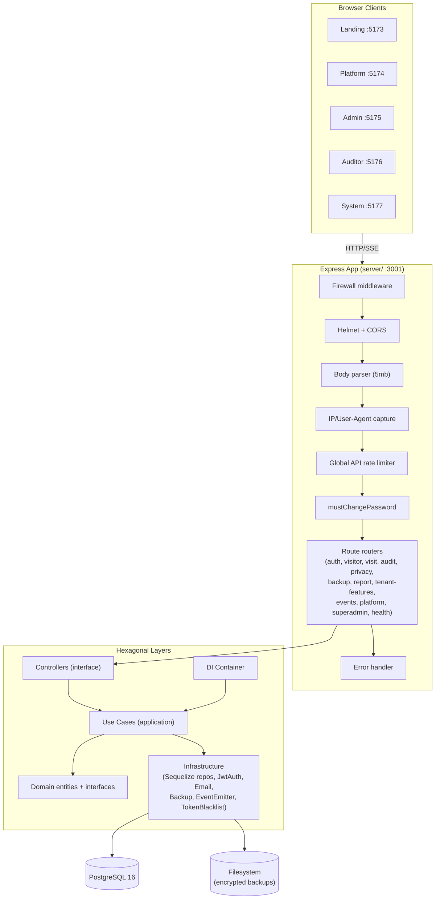
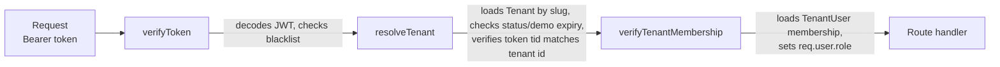
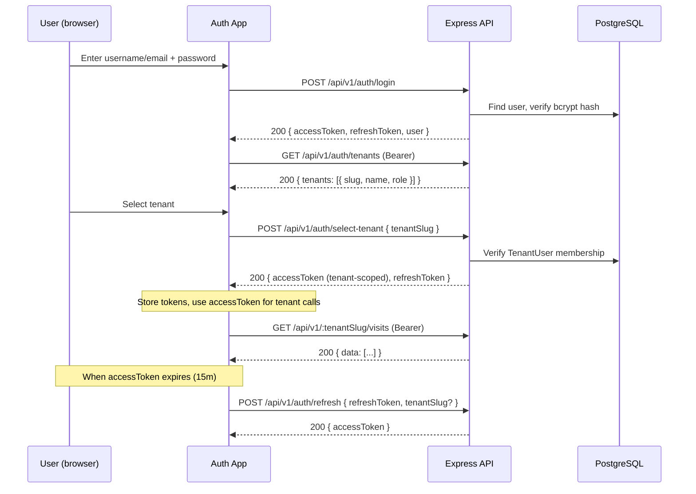
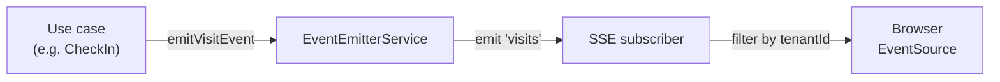
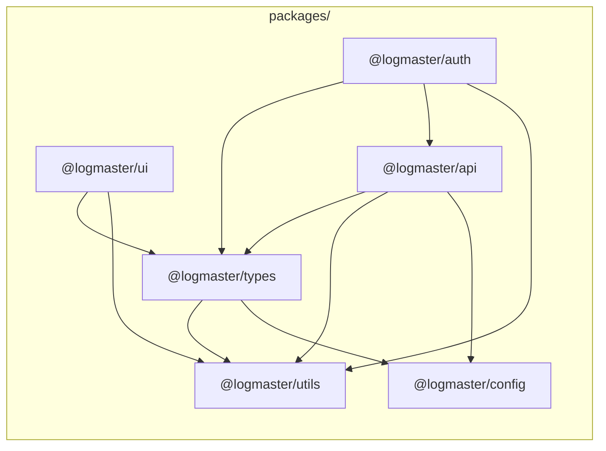

# Architecture

This document describes the LogMaster system architecture: the hexagonal backend design, the multi-tenancy model, authentication/authorization flows, data isolation, real-time, subscription enforcement, backups, security, and the shared package dependency graph.

> For the API reference see [API.md](./API.md). For local setup see [LOCAL_DEV.md](../LOCAL_DEV.md). For deployment see [DEPLOYMENT.md](./DEPLOYMENT.md).

---

## High-Level Architecture



---

## Hexagonal Architecture

The backend (`server/src`) follows a hexagonal (ports & adapters) layout. Dependencies always point inward: the domain has no knowledge of frameworks or databases.

| Layer            | Location                              | Responsibility                                                              |
| ---------------- | ------------------------------------- | --------------------------------------------------------------------------- |
| **Domain**       | `server/src/domain/`                  | Pure entities (`User`, `Tenant`, `TenantUser`, `Visitor`, `Visit`), repository interfaces (`IVisitorRepository`, `IVisitRepository`, `ITenantRepository`, ...), and domain services (`IAuthService`, `IBackupService`, `IEventEmitter`, `ITokenBlacklist`, `PasswordPolicy`). No imports from infrastructure or Express. |
| **Application**  | `server/src/application/`             | Use cases (`CheckInVisitorUseCase`, `LoginUseCase`, `CreateDemoTenantUseCase`, ...), DTOs (`application/dto/`), and mappers (`application/mappers/`). Each use case orchestrates domain entities and repository interfaces. |
| **Infrastructure**| `server/src/infrastructure/`        | Adapters that implement domain interfaces: Sequelize repositories (`SequelizeVisitorRepository`, `SequelizeTenantRepository`, ...), `JwtAuthService`, `EmailService`, `PostgresBackupService`, `EventEmitterService`, `TokenBlacklist`. Also Sequelize models live in `server/src/models/`. |
| **Interface**    | `server/src/controllers/`, `server/src/routes/` | HTTP controllers translate Express requests into use-case calls and build responses via `shared/ApiResponse`. Routes wire middleware chains. |

### Dependency Injection

A singleton `Container` (`server/src/shared/Container.ts`) wires interfaces to concrete implementations and constructs use cases with their dependencies. Controllers access the container via `container.visitorRepository`, `container.createCheckInVisitorUseCase()`, etc. Repositories and services are lazy singletons; use cases are created fresh per request.

---

## Multi-Tenancy Model

LogMaster is a shared-database, tenant-isolated SaaS. All tenant data lives in the same PostgreSQL database, and every row carries a `tenantId` foreign key.

### Core entities

- **`Tenant`** (`models/Tenant.ts`) — `id`, `slug` (unique), `name`, `domain`, `status` (`active` | `suspended` | `trial`), `subscriptionPlan` (`free` | `starter` | `professional` | `enterprise`), `maxUsers`, `maxVisitors`, `subscriptionExpiresAt`, `isDemo`, `demoExpiresAt`, `settings` (JSONB).
- **`TenantUser`** (`models/TenantUser.ts`) — join table between `User` and `Tenant` with a `role` (`admin` | `operador` | `auditor` | `demo`). Unique index on `(userId, tenantId)`. A `beforeCreate` hook enforces subscription user limits via `UsageCounterService`.
- **`User`** (`models/User.ts`) — global identity (`username`, `email`, `password`, `isSuperAdmin`, lockout fields). A user can belong to multiple tenants with different roles.

### tenantId propagation

Every tenant-scoped model (`Visitor`, `Visit`, `ActivityLog`, `ArcoRequest`, `VisitorEditHistory`, `IntermittentLog`) has a non-null `tenantId` column referencing `Tenants.id`. All Sequelize repository queries filter by `tenantId` — there is no path that returns cross-tenant data.

### JWT tenant context

Access tokens carry tenant context in the payload (`server/src/infrastructure/services/JwtAuthService.ts`):

```json
{
  "sub": 1,
  "id": 1,
  "username": "admin@demo-abc12345.com",
  "email": "admin@demo-abc12345.com",
  "tid": 42,
  "tslug": "demo-abc12345",
  "role": "admin"
}
```

Refresh tokens intentionally carry **no** tenant context; tenant selection is revalidated on refresh.

### Middleware chain (tenant-scoped routes)

Every tenant-scoped route applies this chain (`server/src/middleware/auth.ts`):



1. **`verifyToken`** — validates the JWT (HS256), checks the token blacklist, sets `req.user`.
2. **`resolveTenant`** — resolves the tenant from `req.params.tenantSlug` (or `req.user.tslug`), rejects suspended or expired demo tenants, ensures the token's `tid` matches the requested tenant, sets `req.tenantId`.
3. **`verifyTenantMembership`** — confirms a `TenantUser` row exists for `(user.id, tenant.id)`, sets `req.user.role` and `req.tenantRole`.

Platform routes (`/platform/v1/*`) use a simpler chain: `adminLimiter` → `verifyToken` → `isSuperAdmin` (checks `req.user.role === 'root'`).

---

## Authentication Flow



- **Login** (`POST /api/v1/auth/login`) accepts `username` (username **or** email) + `password`. Returns an access token (no tenant context if the user belongs to multiple tenants) and a refresh token.
- **List tenants** (`GET /api/v1/auth/tenants`) returns the tenants the user belongs to with their per-tenant role.
- **Select tenant** (`POST /api/v1/auth/select-tenant`) takes a `tenantSlug`, verifies membership, and returns a new access token scoped to that tenant.
- **Refresh** (`POST /api/v1/auth/refresh`) takes a `refreshToken` and optional `tenantSlug`; revalidates membership and issues a new access token.
- **Logout / token revocation** — access tokens are checked against an in-memory `TokenBlacklist` on every request. `isTokenInvalidatedForUser(userId, iat)` invalidates all tokens issued before a timestamp.
- **Password reset** — `forgot-password` generates a SHA-256-hashed reset token emailed via SMTP; `reset-password` consumes it.
- **Change password** (`POST /api/v1/auth/change-password`) requires a valid access token and enforces the password policy (min 12 chars).

---

## Authorization Model

### Roles

| Role        | Scope   | Source                         | Permissions                                                        |
| ----------- | ------- | ------------------------------ | ------------------------------------------------------------------ |
| `root`      | Global  | `User.isSuperAdmin = true`     | Platform console: tenant CRUD, global users, subscriptions, stats  |
| `admin`     | Tenant  | `TenantUser.role = 'admin'`    | Full tenant management: visitors, visits, backups, reports, ARCO   |
| `operador`  | Tenant  | `TenantUser.role = 'operador'` | Check-in/check-out, visitor registration, active visits            |
| `auditor`   | Tenant  | `TenantUser.role = 'auditor'`  | Read-only: audit logs, ARCO requests, exports (no data mutation)   |
| `demo`      | Tenant  | `TenantUser.role = 'demo'`     | Operador-like access inside demo tenants                           |

### Middleware

- **`isSuperAdmin`** (`middleware/auth.ts`) — rejects unless `req.user.role === 'root'`. Used on all `/platform/v1/*` and `/v1/superadmin/*` routes.
- **`isAdmin`** (`middleware/auth.ts`) — rejects unless `req.user.role === 'admin'`. Used on backup and ARCO cancellation routes.
- **`verifyAuditor`** (`middleware/auditor.ts`) — allows `auditor`, `admin`, and `root`. Used on audit log and ARCO list routes.
- **`denyAuditorOnly`** (`middleware/auditor.ts`) — blocks `auditor` role (allows everyone else). Used on visit/visitor mutation routes so auditors cannot modify data.
- **`requireTenantRole(...roles)`** (`middleware/auth.ts`) — generic role guard for specific tenant roles.

---

## Data Isolation

### tenantId in every query

Every Sequelize repository method receives a `tenantId` and applies it as a `where` filter. Example from `SequelizeVisitorRepository`:

```ts
async findByCedula(tenantId: number, cedula: string): Promise<Visitor | null> {
  return VisitorModel.findOne({
    where: { tenantId, cedula: Encryption.hash(cedula) },
  });
}
```

There is no repository method that queries without a `tenantId`.

### Composite unique constraints

- `Visitors`: unique on `(tenantId, cedula)` — the same cedula can exist in different tenants.
- `TenantUsers`: unique on `(userId, tenantId)` — a user has exactly one role per tenant.
- `Tenants.slug` and `Tenants.domain`: globally unique.

### PII encryption

`cedula` is stored as a SHA-256 hash (for lookup) plus an AES-256-GCM ciphertext (`encrypted_cedula`); `first_name`, `last_name`, `email`, `phone`, `job_title` are stored as AES-256-GCM ciphertexts via model `beforeSave` hooks. See the [Security](#security) section below for full encryption details.

---

## Real-Time (SSE)

Visit updates are pushed to connected clients via Server-Sent Events.

- **Endpoint**: `GET /api/v1/events/visits` (`routes/events.routes.ts`).
- **Auth**: `verifySseToken` reads the token from the `?token=` query parameter (EventSource cannot set headers).
- **Transport**: `text/event-stream` with a 25-second heartbeat comment.
- **Tenant filtering**: the connection's `tenantScope` is `req.user.tid`. The `send` function drops any `VisitRealtimeEvent` whose `tenantId` does not match. System events (e.g. `system:connected`) have no `tenantId` and are always delivered.
- **Emitter**: `EventEmitterService` (`infrastructure/services/EventEmitterService.ts`) wraps Node's `EventEmitter`; use cases call `container.eventEmitter.emitVisitEvent(event)`.



---

## Subscription Enforcement

### Plan definitions

Plans are defined in `server/src/config/subscription.ts` as a frozen `SUBSCRIPTION_PLANS` record:

| Plan           | Visits/month | Max users | Max visitors | Auditor | Calendar | Reports | API | Analytics | Backup freq   | Retention days |
| -------------- | ------------ | --------- | ------------ | ------- | -------- | ------- | --- | --------- | ------------- | -------------- |
| `free`         | 100          | 3         | 1000         | no      | no       | no      | no  | no        | manual        | 7              |
| `starter`      | 500          | 7         | 5000         | yes     | yes      | yes     | no  | no        | daily         | 30             |
| `professional` | 2000         | 21        | 25000        | yes     | yes      | yes     | yes | yes       | four-hour     | 90             |
| `enterprise`   | ∞            | ∞         | ∞            | yes     | yes      | yes     | yes | yes       | continuous    | 365            |

> `null` means unlimited. Limits are overridable via env (`PLAN_*` variables) and per-tenant `maxUsers`/`maxVisitors`/`settings.customLimits`.

### Enforcement points

- **`subscriptionGuard(feature)`** (`middleware/subscriptionGuard.ts`) — checks `limits.features[feature]` and returns `403 SUBSCRIPTION_FEATURE_REQUIRED` if the feature is not in the tenant's plan. Applied to calendar, auditor, and backup-on-demand routes.
- **`enforceCheckInLimits`** (`middleware/subscriptionGuard.ts`) — calls `UsageCounterService.assertCanCreateVisit` and, if the visitor is new, `assertCanCreateVisitor`. Returns `403 VISIT_LIMIT_EXCEEDED` / `VISITOR_LIMIT_EXCEEDED`.
- **`enforceUserLimit`** — called from the `TenantUser.beforeCreate` hook and platform user-creation routes; enforces total user cap and per-role caps (`usersByRole`).
- **`UsageCounterService`** (`services/UsageCounterService.ts`) — counts current-month visits, total visitors, active users, and users-by-role against the tenant's plan limits.

### Revenue (MRR)

`PLAN_PRICES` (`config/subscription.ts`) provides static monthly prices for MRR estimation: `free=0`, `starter=29`, `professional=79`, `enterprise=299`. Demo tenants contribute 0 MRR. The platform stats endpoint aggregates this across tenants.

---

## Backup System

The backup system is implemented in `server/src/infrastructure/services/PostgresBackupService.ts` (implements `IBackupService`).

- **Mechanism**: shells out to `pg_dump --format=custom`, then encrypts the dump with AES-256-GCM using a key derived via `scryptSync(BACKUP_PASSWORD || ENCRYPTION_KEY, salt, 32)`.
- **Restore password**: each backup generates a one-time password in the format `trebol-XXXXXXXX-NNNN` (8 random chars + 4-digit PIN). The SHA-256 hash is stored in a `.meta` sidecar file; the plaintext is returned once to the caller.
- **Per-tenant vs global**: `createBackup(tenantId?)` produces `tenant-{id}-backup-{timestamp}.dump.enc` or `backup-{timestamp}.dump.enc`.
- **Scheduling**: `server/src/utils/backupScheduler.ts` polls tenants and creates backups according to each plan's `backupFrequency` (`manual`, `daily`, `four-hour`, `continuous`). Poll interval is `BACKUP_SCHEDULER_POLL_MINUTES` (default 15).
- **Retention**: each plan defines `backupRetentionCount`; old backups beyond the count are pruned.
- **Routes**: global backups under `/api/v1/backups` (admin only); tenant backups under `/api/v1/:tenantSlug/backups` (admin + `backupOnDemand` feature flag).

---

## Security

LogMaster is designed with defense-in-depth for a multi-tenant SaaS handling personal data subject to GDPR and Argentina's Ley 25.326. The key security controls are:

1. **Tenant isolation** — `tenantId` on every row, enforced in every repository query.
2. **PII encryption at rest** — AES-256-GCM for sensitive fields.
3. **JWT auth** — short-lived access tokens, refresh tokens, token blacklist, bcrypt hashing.
4. **Role-based authorization** — tenant roles + global superadmin, enforced via middleware.
5. **Audit logging** — immutable `ActivityLogs` with IP, UA, method, path, status, duration, severity.
6. **Rate limiting** — per-endpoint limiters to prevent brute force and abuse.
7. **Application firewall** — IP blocking, suspicious UA/path detection, payload size limits, attack-pattern scanning.
8. **Secure headers** — Helmet (CSP, HSTS, X-Frame-Options, referrer-policy).
9. **CORS allow-list** — explicit origin allow-list, no wildcard.

### Multi-Tenant Data Isolation

#### tenantId enforcement

Every tenant-scoped Sequelize model (`Visitor`, `Visit`, `ActivityLog`, `ArcoRequest`, `VisitorEditHistory`, `IntermittentLog`) has a non-null `tenantId` column with a foreign key to `Tenants.id`. Every repository method receives a `tenantId` and applies it as a `where` filter — there is no repository method that queries without one.

#### JWT tenant context

Access tokens carry `tid` (tenant id) and `tslug` (tenant slug). The `resolveTenant` middleware (`server/src/middleware/auth.ts`) verifies that the token's `tid` matches the tenant resolved from the URL `:tenantSlug`. If they differ, the request is rejected with `403 FORBIDDEN`.

#### Composite unique constraints

- `Visitors`: unique on `(tenantId, cedula)` — the same cedula can exist in different tenants without collision.
- `TenantUsers`: unique on `(userId, tenantId)` — one role per user per tenant.

#### Cross-tenant test coverage

The server test suite includes security tests (`server/src/__tests__/security/`) that verify cross-tenant access is blocked: a user scoped to tenant A cannot read tenant B's visitors, visits, or audit logs.

### PII Encryption

#### Algorithm

AES-256-GCM (authenticated encryption) via Node's `crypto` module. Implementation: `server/src/utils/Encryption.ts`.

#### Encrypted fields (Visitor model)

| Field | Storage | Notes |
| ----- | ------- | ----- |
| `cedula` | SHA-256 hash (`cedula` column) + AES-256-GCM ciphertext (`encrypted_cedula` column) | Hash enables lookup; ciphertext enables decryption |
| `first_name` | AES-256-GCM ciphertext | `beforeSave` hook encrypts on change |
| `last_name` | AES-256-GCM ciphertext | `beforeSave` hook encrypts on change |
| `email` | AES-256-GCM ciphertext | `beforeSave` hook encrypts on change |
| `phone` | AES-256-GCM ciphertext | `beforeSave` hook encrypts on change |
| `job_title` | AES-256-GCM ciphertext | `beforeSave` hook encrypts on change |

#### Ciphertext format

```
ENC:<ciphertext>:<iv-hex>:<authTag-hex>
```

The `ENC:` prefix and the `isEncrypted()` helper allow the system to handle legacy plaintext data gracefully (decrypt only if encrypted).

#### Edit history PII

`VisitorEditHistory` (`server/src/models/VisitorEditHistory.ts`) tracks field-level changes. The `PII_EDIT_FIELDS` set (`first_name`, `last_name`, `email`, `phone`, `job_title`, `cedula`) determines which `oldValue`/`newValue` pairs are encrypted in the audit trail via a `beforeSave` hook. Non-PII fields (e.g. `company`) remain plaintext.

#### Key management

- **`ENCRYPTION_KEY`** (env, 64 hex chars = 32 bytes) — the AES-256 key. Falls back to `PII_ENCRYPTION_KEY` if `ENCRYPTION_KEY` is unset.
- **`PII_ENCRYPTION_KEY`** (env) — alias for forward compatibility; falls back to `ENCRYPTION_KEY`.
- In production, `AppConfig.validate()` requires `ENCRYPTION_KEY` or `PII_ENCRYPTION_KEY` to be set.
- **Key rotation**: not automated. Rotating the key requires re-encrypting all PII columns (a migration script). The `isEncrypted()` helper and `ENC:` prefix are designed to support future rotation.

> **Warning**: if `ENCRYPTION_KEY` is not set, the `Encryption.encrypt()` method logs a warning and stores plaintext. This must never happen in production.

### Authentication

#### JWT

- **Algorithm**: HS256.
- **Access token**: signed with `JWT_SECRET`, expires in `JWT_ACCESS_EXPIRATION` (default 15m). Carries `sub`, `id`, `username`, `email`, `tid`, `tslug`, `role`.
- **Refresh token**: signed with `JWT_REFRESH_SECRET` (auto-derived from `JWT_SECRET` via SHA-256 if not set), expires in `JWT_REFRESH_EXPIRATION` (default 7d). Carries only `sub`, `id`, `username`, `email` — no tenant context.
- **`JWT_SECRET`** is required in all environments (no default fallback). `AppConfig.validate()` throws if missing.

#### Password hashing

- **bcrypt** with `BCRYPT_ROUNDS` (default 12, configurable via env).
- Passwords are never logged or returned in API responses.

#### Password policy

`server/src/domain/services/PasswordPolicy.ts` enforces:
- Minimum 12 characters (for reset/change).
- Common-password rejection (`server/src/domain/services/common-passwords.ts`).
- Confirm-password match (change-password endpoint).

#### Account lockout

- `MAX_LOGIN_ATTEMPTS` (default 5) failed attempts lock the account for `LOCKOUT_DURATION_MINUTES` (default 15).
- Tracked on the `User` model (`loginAttempts`, `lockedUntil`).

#### Token blacklist

`server/src/infrastructure/services/TokenBlacklist.ts` (implements `ITokenBlacklist`):
- `isBlacklisted(token)` — checks if a specific token string is revoked.
- `isTokenInvalidatedForUser(userId, iat)` — checks if all tokens issued before a timestamp are invalidated (used for password changes and role revocation).
- In-memory store (sufficient for single-server deployment; for multi-instance, use Redis).

#### Must-change-password

`server/src/middleware/mustChangePassword.ts` blocks all `/api` routes (except auth/password endpoints) if `req.user.mustChangePassword === true`, forcing the user to change their password before using the system.

### Authorization

#### Roles

| Role | Scope | Source | Middleware |
| ---- | ----- | ------ | ---------- |
| `root` | Global | `User.isSuperAdmin = true` | `isSuperAdmin` (checks `role === 'root'`) |
| `admin` | Tenant | `TenantUser.role` | `isAdmin` |
| `operador` | Tenant | `TenantUser.role` | (default tenant role) |
| `auditor` | Tenant | `TenantUser.role` | `verifyAuditor` (allows auditor + admin + root); `denyAuditorOnly` blocks auditor from mutations |
| `demo` | Tenant | `TenantUser.role` | (operador-like in demo tenants) |

#### Middleware chain

- **Tenant routes**: `verifyToken` → `resolveTenant` → `verifyTenantMembership` (sets `req.user.role` from `TenantUser`) → optional role guards (`isAdmin`, `verifyAuditor`, `denyAuditorOnly`).
- **Platform routes**: `adminLimiter` → `verifyToken` → `isSuperAdmin`.
- **Superadmin (legacy)**: `adminLimiter` → `verifyToken` → `isSuperAdmin`.

#### Tenant membership

`verifyTenantMembership` queries `TenantUser` for `(req.user.id, req.tenantId)`. If no membership exists, the request is rejected with `403 FORBIDDEN`. This prevents a user from accessing a tenant they don't belong to, even with a valid token.

### Audit Logging

#### Model

`ActivityLog` (`server/src/models/ActivityLog.ts`) — immutable (`updatedAt: false`), tenant-scoped (`tenantId`).

| Field | Description |
| ----- | ----------- |
| `userId`, `username` | Who performed the action |
| `action` | Action type (e.g. `LOGIN`, `CHECK_IN`, `VISITOR_UPDATE`) |
| `entity`, `entityId` | Affected entity |
| `details` | JSON string with context |
| `ipAddress`, `userAgent` | Captured via `captureClientInfo` middleware |
| `method`, `path` | HTTP method and path |
| `statusCode`, `duration` | Response status and request duration |
| `severity` | `low` / `medium` / `high` / `critical` |
| `role`, `resource`, `resourceId` | Extended context |
| `status` | `success` / `failure` |

#### Retention

`AUDIT_LOG_RETENTION_DAYS` (default 365) controls how long audit logs are kept. This should be longer than `DATA_RETENTION_DAYS` (default 60) so audit evidence outlives the personal data it references.

#### IP/User-Agent capture

`server/src/middleware/ipCapture.ts` runs on every request and attaches `req.ip` and `req.get('User-Agent')` for audit logging.

### Rate Limiting

All limiters are defined in `server/src/middleware/rateLimiter.ts` using `express-rate-limit`. In-memory store (single-server). IPv4-mapped IPv6 addresses are normalized.

| Limiter | Window | Max (prod) | Key | Applies to |
| ------- | ------ | ---------- | ---- | ---------- |
| `apiLimiter` | 15 min | 1000 | IP | All `/api` routes (global) |
| `strictLimiter` | 1 min | 60 | IP | Sensitive operations |
| `authLimiter` | 15 min | 5 (failed) | `IP:path` | `/auth/login`, `/auth/forgot-password`, `/auth/reset-password` (skips successful requests) |
| `refreshLimiter` | 1 hour | 30 | `user:<id>` (from refresh token) or IP | `/auth/refresh` |
| `passwordResetLimiter` | 1 hour | 3 | `IP:password-reset` | Password reset endpoints |
| `uploadLimiter` | 1 hour | 50 | `IP:upload` | File uploads |
| `reportLimiter` | 1 hour | 20 | `IP:report` | Report generation |
| `adminLimiter` | 5 min | 30 | `user:<id>` or IP | Platform + superadmin routes |
| `demoLimiter` | 1 hour | 3 | `IP:demo` | `/auth/demo` |
| `demoTenantLimiter` | 1 min | 30 | `demo-tenant:<tenantId>` | All `/v1/:tenantSlug/*` routes — **skips non-demo tenants**. Throttles demo tenant traffic per-tenant (not per-user) to prevent abuse. |

> In development, limits are relaxed (e.g. auth 20, refresh 120, demo 15) to avoid friction.

#### Rate limit response

```json
{
  "success": false,
  "error": {
    "code": "RATE_LIMIT",
    "message": "Too many authentication attempts, please try again later.",
    "retryAfter": 900
  }
}
```

### Photo / Content Handling

#### Storage

Photos (face and ID) are stored as `BLOB`/`BYTEA` columns (`photo_data`, `id_photo_data`) in the `Visitors` table — not on the filesystem. This keeps PII inside the encrypted database boundary.

#### Content-type detection

`server/src/utils/detectImageType.ts` inspects the leading magic bytes of the binary blob to determine the MIME type:

| Magic bytes | MIME type |
| ----------- | --------- |
| `FF D8 FF` | `image/jpeg` |
| `89 50 4E 47` | `image/png` |
| `47 49 46 38` | `image/gif` |
| (unknown) | `image/jpeg` (legacy default) |

This prevents content-type spoofing — the server never trusts a client-supplied `Content-Type` for stored photos.

#### Streaming

Photo endpoints (`GET /visitors/:cedula/photo`, `GET /visitors/:cedula/id-photo`) stream the binary blob with the detected `Content-Type` and a `crossOriginResourcePolicy: 'cross-origin'` Helmet setting so the frontend (on a different port) can load them as BLOB URLs.

#### Upload limits

- Body size limit: 5mb (`express.json({ limit: '5mb' })`).
- Firewall rejects payloads > 10mb (`Content-Length` check) with `413 PAYLOAD_TOO_LARGE`.
- Base64 photo fields are capped at 5,000,000 chars in the Zod schema.

### SSE Security

#### Authentication

`verifySseToken` (`server/src/middleware/auth.ts`) reads the token from the `lm_access_token` httpOnly cookie (preferred — cookies are not logged by proxies/nginx), falling back to the `?token=` query parameter for backward compatibility with existing clients. The token is validated the same way as Bearer tokens (JWT verify + blacklist check).

> **Note**: The query-parameter path is deprecated. New clients should rely on the cookie set by the hybrid auth flow (login/refresh/selectTenant).

#### Tenant filtering

The SSE handler (`server/src/routes/events.routes.ts`) captures `tenantScope = req.user.tid` on connection. The `send` function drops any `VisitRealtimeEvent` whose `tenantId` does not match `tenantScope`. System events (no `tenantId`) are always delivered.

#### Heartbeat

A `:heartbeat` comment is sent every 25 seconds to keep the connection alive through proxies.

#### Connection cleanup

On `req.on('close')`, the heartbeat interval is cleared, the event subscription is unsubscribed, and the response is ended — preventing listener leaks.

### Demo Tenant Isolation

#### Data isolation

Demo tenants use the same `tenantId` scoping as production tenants. Every repository query filters by `tenantId`, so a demo tenant cannot access another tenant's data.

#### Plan restrictions

Demo tenants are created on the `starter` plan (so the auditor role is permitted). They cannot self-upgrade their plan or lift restrictions — plan mutations live under `/platform/v1/*` which requires `isSuperAdmin`.

#### Expiry

Demo tenants have `isDemo = true` and `demoExpiresAt` (7 days from creation). The `resolveTenant` middleware rejects requests to expired demo tenants with `403 TENANT_UNAVAILABLE`.

#### Rate limiting

Demo creation is rate-limited by `demoLimiter` (3 / hour per IP) to prevent abuse.

### Known Limitations / TODOs

| Item | Status | Details |
| ---- | ------ | ------- |
| Token blacklist store | In-memory | The `TokenBlacklist` is in-memory. For multi-instance deployments, replace with Redis. |
| Rate limiter store | In-memory | `express-rate-limit` uses an in-memory store. For multi-instance, configure a Redis store (`rate-limit-redis` + `connect-redis`). Required when scaling beyond a single server instance — without it, an attacker can rotate between nodes to bypass limits. |
| Firewall state | In-memory | `BLOCKED_IPS` and `securityEvents[]` in `firewall.ts` are per-process. Restarting the server loses all blocks. For multi-instance or persistent blocking, move to a shared store (Redis or a dedicated WAF). |
| CSP nonces | Deferred | `helmet` CSP uses `scriptSrc: 'unsafe-inline'` for Vite SPA dev compatibility. Once all apps migrate to Next.js with SSR, switch to per-request nonces via `helmet.contentSecurityPolicy.generateNonce()` for strict CSP. |
| Key rotation | Manual | No automated PII key rotation. The `isEncrypted()` helper supports future rotation but a migration script is needed. |
| Payment integration | None | `PLAN_PRICES` are static for MRR estimation; no real billing provider is integrated. |

### Deployment Security Best Practices

1. **Set all required env vars**: `JWT_SECRET` (min 32 chars), `ENCRYPTION_KEY` (64 hex chars), `DB_PASSWORD`, `BACKUP_PASSWORD`. Never use the `.env.example` placeholder values in production.
2. **Generate strong secrets**:
   ```bash
   node -e "console.log(require('crypto').randomBytes(64).toString('hex'))"  # JWT
   node -e "console.log(require('crypto').randomBytes(32).toString('hex'))"  # Encryption
   ```
3. **Set `NODE_ENV=production`** — relaxes rate limits appropriately and disables Swagger UI by default. To explicitly enable Swagger in a non-production-like prod env, set `ALLOW_SWAGGER=true`.
4. **Enable SSL/TLS** — terminate TLS at a reverse proxy (Nginx/Caddy) in front of the Express server. Set `DB_SSL=true` for remote Postgres.
5. **Restrict CORS** — set `ALLOWED_ORIGINS` and/or `PRODUCTION_DOMAIN` to your exact frontend origins. Never use wildcard CORS. Null/empty origins are rejected (defence against sandboxed iframes and `file://`/`data:` URLs).
6. **Firewall the database** — Postgres should only be reachable from the server container/host, not the public internet.
7. **Use secrets management** — in production, inject env vars from a secrets manager (AWS Secrets Manager, Vault, etc.), not a committed `.env` file.
8. **Regular backups** — verify the backup scheduler is running and test restores periodically. Store backup restore passwords securely (they are one-time).
9. **Log monitoring** — ship Winston logs to a log aggregator; alert on `severity: critical` audit events and firewall blocks.
10. **Keep dependencies updated** — run `pnpm audit --audit-level=high` regularly; the `security.yml` CI workflow runs this on PRs.
11. **Disable Swagger in production** — the `api-docs` route is automatically disabled when `NODE_ENV=production`. `ALLOW_SWAGGER=true` overrides this for staging/debugging only.
12. **Change seed passwords** — the `SEED_*_PASSWORD` values in `.env.example` are for development only. Set unique passwords in production before seeding.
13. **Configure Redis for multi-instance** — if running more than one server instance, set up a Redis store for rate limiters and the token blacklist to prevent bypass via node rotation.

---

## Shared Packages Dependency Graph



| Package            | Exports                                                | Consumed by                              |
| ------------------ | ------------------------------------------------------ | ---------------------------------------- |
| `@logmaster/types` | Shared TypeScript types (User, Visit, Visitor, etc.)   | all apps, api, auth, ui, utils           |
| `@logmaster/utils` | Shared utilities (formatters, validators)              | all apps, ui, api, auth                  |
| `@logmaster/config`| Shared config (Tailwind preset, env helpers)           | all apps, api                            |
| `@logmaster/ui`    | Shared UI components (buttons, inputs, layout)         | admin, auditor, system                   |
| `@logmaster/api`   | API client (axios instance + react-query hooks)        | admin, auditor, system, platform         |
| `@logmaster/auth`  | Auth context, useAuth hook, token storage              | admin, auditor, system                   |

> `apps/landing` and `apps/platform` do not depend on `@logmaster/ui` / `@logmaster/auth` (they have their own minimal UI and auth). `server/` is **not** part of the pnpm workspace — it is invoked via `pnpm --dir server`.
