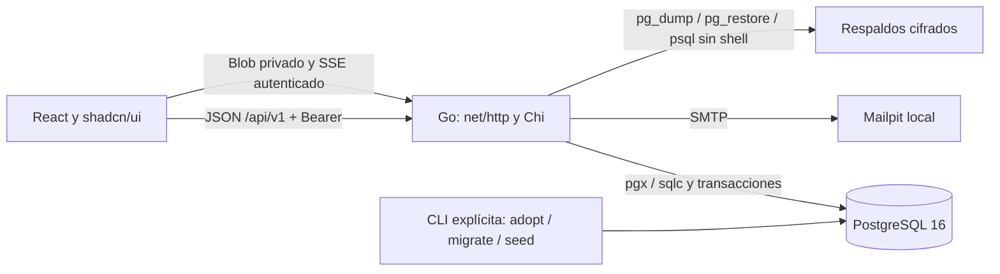

# Arquitectura de LogMaster

El cliente React/TypeScript en `client/` consume la API Go en `server-go/`. El servidor TypeScript en `server/` se conserva para regresión y reversión controlada; no es el backend predeterminado.

```mermaid
flowchart LR
  Browser[React y shadcn/ui] -->|JSON /api/v1 + Bearer| API[Go: net/http y Chi]
  Browser -->|Blob privado y SSE autenticado| API
  API -->|pgx / sqlc y transacciones| PG[(PostgreSQL 16)]
  API -->|SMTP| Mail[Mailpit local]
  API -->|pg_dump / pg_restore / psql sin shell| Backup[Respaldos cifrados]
  CLI[CLI explícita: adopt / migrate / seed] --> PG
```

`cmd/logmaster` coordina configuración, comprobación del esquema, servidor y apagado. `internal/httpapi` contiene los handlers y reglas de operación; `internal/store` contiene consultas pgx generadas con sqlc. `internal/security` conserva los formatos criptográficos; `internal/backup` contiene el archivo cifrado y la ejecución binaria de PostgreSQL; `db` contiene las migraciones SQL y la adopción de la baseline validada.

La sesión se valida contra el usuario actual de PostgreSQL en cada solicitud y durante el SSE. La API aplica roles, cambio obligatorio, límites de solicitud y contraseña adicional. El perfil y los valores personales del historial se cifran; las fotografías son BYTEA y solo se sirven autenticadas.

El registro de visita y sus datos, las transiciones e intervalos, las ediciones y la cancelación confirman su auditoría en la misma transacción. Se usan bloqueos de filas y restricciones parciales para impedir visitas o intervalos abiertos duplicados. La retención adquiere un bloqueo asesor y verifica la antigüedad y las referencias antes de eliminar registros.

Los rangos de informes se calculan en America/Caracas, con almacenamiento TIMESTAMPTZ. Las listas se paginan en SQL; las búsquedas sobre nombres cifrados recorren los perfiles para comparar. Este recorrido puede requerir una estrategia de índice adicional si el volumen institucional lo exige.

Goose prepara el esquema por un comando explícito; el arranque solo comprueba su versión. Las migraciones inversas rechazan la eliminación de datos de consentimiento. Los detalles, restricciones locales y ensayos están en [BACKEND_GO_MIGRATION](BACKEND_GO_MIGRATION.md).
