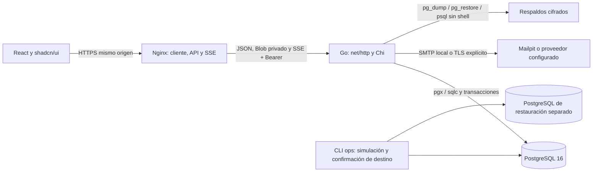

# Arquitectura de LogMaster

El cliente React/TypeScript en `client/` consume la API Go en `server-go/`, el único backend vigente. La referencia `backup/node-before-retirement-2026-10-10` conserva el servidor anterior; los fixtures y las pruebas Go mantienen sus contratos, esquema y formatos criptográficos.

```mermaid
flowchart LR
  Browser[React y shadcn/ui] -->|HTTPS mismo origen| Proxy[Nginx: cliente, API y SSE]
  Proxy -->|JSON, Blob privado y SSE + Bearer| API[Go: net/http y Chi]
  API -->|pgx / sqlc y transacciones| PG[(PostgreSQL 16)]
  API -->|SMTP local o TLS explícito| Mail[Mailpit o proveedor configurado]
  API -->|pg_dump / pg_restore / psql sin shell| Backup[Respaldos cifrados]
  CLI[CLI ops: simulación y confirmación de destino] --> PG
  CLI --> Stage[(PostgreSQL de restauración separado)]
```

`cmd/logmaster` coordina configuración, comprobación del esquema, servidor y apagado. `internal/httpapi` contiene los handlers y reglas de operación; `internal/store` contiene consultas pgx generadas con sqlc. `internal/security` conserva los formatos criptográficos; `internal/backup` contiene el archivo cifrado y la ejecución binaria de PostgreSQL; `db` contiene las migraciones SQL y la adopción de la baseline validada.

La sesión se valida contra el usuario actual de PostgreSQL en cada solicitud y durante el SSE. La API aplica roles, cambio obligatorio, límites de solicitud y contraseña adicional. El perfil y los valores personales del historial se cifran; las fotografías son BYTEA y solo se sirven autenticadas.

El registro de visita y sus datos, las transiciones e intervalos, las ediciones y la cancelación confirman su auditoría en la misma transacción. Se usan bloqueos de filas y restricciones parciales para impedir visitas o intervalos abiertos duplicados. La retención adquiere un bloqueo asesor y verifica la antigüedad y las referencias antes de eliminar registros.

Los rangos se calculan en America/Caracas, con TIMESTAMPTZ. Las listas se paginan en SQL y las estadísticas se agregan en PostgreSQL. La búsqueda usa trigramas HMAC-SHA-256, clave derivada con contexto exclusivo y verificación exacta tras descifrar solo candidatos. Perfil/índice cambian en la misma transacción; cancelación elimina sus entradas. La reconstrucción por lotes es idempotente y el arranque exige estado listo y fingerprint correcto. El calendario agrega conteos diarios y carga detalle paginado para fechas densas.

Administración carga gráficos, estadísticas, calendario y respaldos al abrir sus pestañas; ExcelJS/jsPDF se importan al exportar. Se comprueba el total antes de recopilar páginas: PDF 2.000, Excel 20.000. La recopilación admite cancelación y detecta cambios en los datos.

Compose utiliza imágenes con versiones/digests, usuarios dedicados, secretos de archivo y volúmenes separados. Solo publica HTTPS; el override de ensayo liga diagnósticos a loopback. Nginx limita solicitudes a 5 MB y desactiva buffering SSE. Systemd programa respaldo diario y restauración semanal desechable. Véase [OPERATIONS](OPERATIONS.md).

Goose prepara el esquema por un comando explícito; el arranque solo comprueba su versión. Las migraciones inversas rechazan la eliminación de datos de consentimiento. Los detalles, restricciones locales y ensayos están en [BACKEND_GO_MIGRATION](BACKEND_GO_MIGRATION.md).
